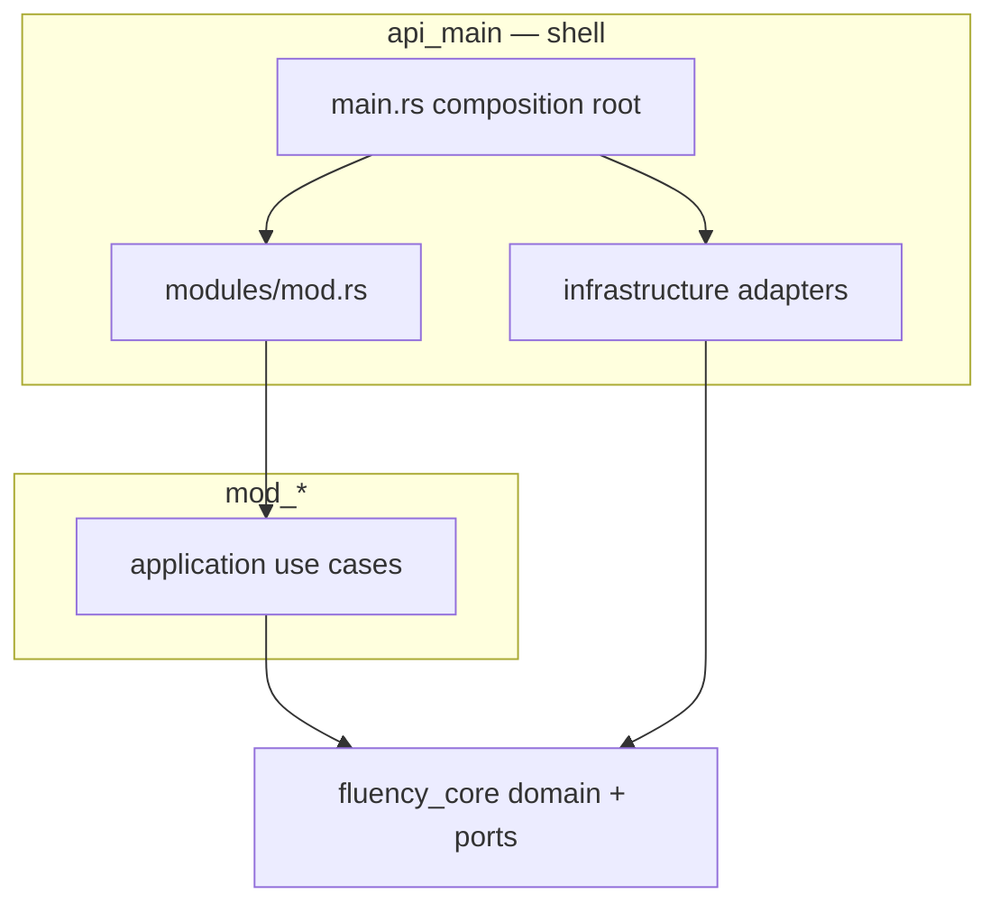

# Arquitectura Modular — Fluency

Documento canónico del modelo **Clean / Hexagonal modular** con **registry**, **sparse-checkout**, **conexión/desconexión de módulos** por capa y aplicación explícita de principios **SOLID**.

**Deploy / Git / Azure:** [`DEPLOY_Y_REPOSITORIO.md`](DEPLOY_Y_REPOSITORIO.md)

---

## 1. Visión

El repositorio es un **monolito modular**:

| Pieza | Rol |
|-------|-----|
| **Shell compartido** | Arranque, auth, layout, tutor, health, notificaciones |
| **Módulos de negocio** | Flashcards, pronombres, futuros módulos vendibles |
| **Registry** | `scripts/module_registry.sh` — fuente de verdad de paths, features y flags |
| **Sparse-checkout** | Solo existen en disco los archivos del shell + módulos activos → la IA no ve código ajeno |

Objetivos de diseño:

- Conectar y desconectar módulos en **compile-time** (Cargo features) y **runtime** (flags Vite)
- Trabajar con **git sparse-checkout** para aislamiento físico de contexto
- Aplicar **SOLID** y **Ports & Adapters** en backend y mantener el frontend desacoplado mediante shell + registry modular
- Tolerar cambio de tecnología vía puertos (`fluency_core`)
- Mantenible y testeable por módulo

---

## 2. Mapa del repositorio

```
flashcard/
├── backend/
│   ├── core/                 # fluency_core — dominio + puertos compartidos
│   ├── mod_shell/            # casos de uso compartidos del shell (auth, tutor, presence, subscriptions)
│   ├── api_main/             # composition root (shell HTTP)
│   │   └── src/modules/      # registro de rutas por módulo
│   ├── mod_flashcards/       # casos de uso flashcards (deck, audio, imágenes, batch CLI)
│   │   └── src/batch/        # --batch-gen-images / --batch-gen-audio (composition desde main)
│   └── mod_pronoun/          # crate pronoun_practice — StoryUseCases
├── client/
│   └── src/
│       ├── modules/          # registry frontend (loader + módulos)
│       │   ├── index.js
│       │   ├── flashcards/   # ports, adapters, useCases, hooks, composition.js
│       │   └── pronounPractice/
│       ├── repositories/     # shell: AuthRepository (httpClient)
│       └── context/          # shell: UIContext, AuthContext, AppContext
├── scripts/
│   ├── module_registry.sh    # FUENTE DE VERDAD
│   ├── sparse-module.sh
│   ├── export-module.sh
│   └── validate-module.sh
└── modules/README.md           # resumen humano del registry
```

---

## 3. Backend — capas y registro

### 3.1 Capas (hexagonal)



| Capa | Ubicación | Responsabilidad |
|------|-----------|-----------------|
| Dominio + puertos | `backend/core` | Modelos, traits async (`StorageRepository`, `AITutor`, …) |
| Aplicación | `backend/mod_*` | Casos de uso por módulo y shell (`mod_shell`, `mod_flashcards`, `mod_pronoun`) |
| API | `backend/api_main/src/api/` | Handlers HTTP delgados; DTOs en `dto/`; mapeo HTTP→use case en `mappers/` |
| Infraestructura | `backend/api_main/src/infrastructure/` | Adapters por puerto: `storage/surreal/*`, Gemini, ComfyUI, storage local |
| Composition root | `backend/api_main/src/main.rs` | Wiring de dependencias y `AppState` |
| Registro modular | `backend/api_main/src/modules/` | `register_routes()` por módulo |

### 3.2 Features Cargo (`api_main/Cargo.toml`)

```toml
[features]
default = ["flashcards", "auth"]
flashcards = ["mod_flashcards"]
auth = []
pronoun_practice = ["dep:pronoun_practice"]
```

| Módulo registry | Feature | Crate |
|-----------------|---------|-------|
| `flashcards` | `flashcards` | `mod_flashcards` |
| `pronoun` | `pronoun_practice` | `pronoun_practice` (`mod_pronoun/`) |

**Build solo pronombres:**

```bash
cargo build -p api_main --no-default-features --features auth,pronoun_practice
```

**Build solo flashcards:**

```bash
cargo build -p api_main --no-default-features --features auth,flashcards
```

### 3.3 Registro de rutas

Cada módulo expone `register_routes(app) -> Router` en `api_main/src/modules/`:

- `flashcards.rs` — decks, media, assets `/card_images`, `/card_audio`
- `pronoun_practice.rs` — progreso, episodios, historias

El shell registra siempre: `/api/health`, `/api/features`, tutor, notificaciones, auth (si feature activa).

`TutorUseCases` usa `Option<PronounPracticeRepository>` — sin módulo pronoun no hay acoplamiento a su DB.

**Persistencia (ISP):** `SurrealConnection` comparte el cliente; cada puerto DB tiene su adapter (`SurrealUserRepository`, `SurrealCardProgressRepository`, `SurrealPronounRepository`, …) en `infrastructure/storage/surreal/`.

**Batch CLI:** la lógica masiva de imágenes/audio vive en `mod_flashcards/src/batch/`; `main.rs` solo compone `ImageBatchContext` / `AudioBatchContext` y delega.

**HTTP delgado:** `generation.rs` usa DTOs (`api/dto/generation.rs`) y mappers (`api/mappers/flashcards.rs`); los endpoints no importan tipos de `mod_flashcards` directamente.

---

## 4. Frontend — Clean / Hexagonal modular

El frontend replica la misma dinámica que el backend: **shell + módulos** con capas internas **ports → use cases → composition root → adapters**.

### 4.1 Mapa de capas por módulo

```
client/src/
├── context/              # shell: AuthContext, UIContext (solo UI global)
├── services/httpClient.js # adaptador HTTP compartido del shell
├── config/index.js       # flags Vite + apiUrl (shell)
└── modules/
    ├── index.js          # registry + composition root global
    ├── flashcards/
    │   ├── composition.js       # wiring: ports ← adapters(httpClient)
    │   ├── ports/               # contratos (equivalente fluency_core traits)
    │   ├── adapters/            # HTTP + media (equivalente infrastructure)
    │   ├── useCases/            # lógica pura de aplicación (deckUseCases, deckSessionUseCases)
    │   ├── hooks/               # orquestación React (useDeckSession)
    │   ├── queries/             # (solo si usa React Query)
    │   ├── domain/              # modelos/datos estáticos del módulo
    │   ├── config/              # config + i18n exclusiva (catalogOrder, sidebarLabels)
    │   ├── context/             # estado React del módulo
    │   ├── uiBridge.js          # puente shell↔módulo (FloatingMenu)
    │   └── index.jsx            # manifest del registry
    └── pronounPractice/
        ├── composition.js
        ├── ports/
        ├── adapters/
        ├── queries/storyQueries.js
        ├── domain/pronounReferenceData.js
        └── index.jsx
```

| Capa frontend | Equivalente backend | Responsabilidad |
|---------------|---------------------|-----------------|
| `ports/` | `fluency_core::ports` | Contratos de datos/servicios |
| `useCases/` / `queries/` | `mod_*` | Orquestación de negocio |
| `adapters/` | `api_main/infrastructure` | HTTP, storage, APIs externas |
| `composition.js` | `api_main/main.rs` | Inyección de dependencias |
| `index.jsx` + `modules/index.js` | `api_main/modules/` | Registro de rutas y providers |
| `context/` (módulo) | handlers delgados | Estado de presentación |
| Shell `App.jsx` | composition root HTTP | Layout, auth, lab, registry |

### 4.2 Loader (`client/src/modules/index.js`)

Auto-descubre `./<modulo>/index.jsx` (sparse-checkout decide qué existe) y exporta:

- `initModules()` — carga async de manifests
- `getModuleRoutes(config)` — rutas React Router
- `getModuleNavSections(config, ctx)` — sidebar
- `getModuleOverlays(config)` — modales globales del módulo
- `getModuleFloatingMenuItems(config, ctx)` — menú flotante
- `getModuleShellProviders(config)` — providers que el módulo monta fuera de sus rutas (ej. `FlashcardUiProvider`)

### 4.3 Contrato de un módulo frontend

```javascript
export default {
  id: 'miModulo',
  enabled: (config) => config.features.miModulo,
  routes: (config) => [{ path: '/ruta', element: <Page /> }],
  navSections: ({ language, config }) => [{ id, label, items: [...] }],
  overlays: () => <MisOverlays />,              // opcional
  floatingMenuItems: (ctx) => [...],            // opcional
  shellProviders: (config) => [MiUiProvider],   // opcional
};
```

Flujo de datos (hexagonal):

```
Page → hooks → useCases/queries → port → adapter(httpClient)
```

### 4.4 Shell frontend (`App.jsx`)

El shell **no importa** páginas ni repositorios de módulos. Solo:

- Layout (Sidebar, Header, Footer, FloatingMenu)
- Rutas de laboratorio/admin (`/admin`, `/grammar`, `/test`)
- `getAppRoutes`, `getModuleOverlays`, `getModuleShellProviders`

Reglas de aislamiento (Jun 2026):

- Estado UI de un módulo vive en su `context/` (ej. `FlashcardUiContext`), **no** en `UIContext` del shell.
- Config de dominio vive en `modules/<nombre>/config/` (ej. `catalogOrder`, `translations`, `sidebarLabels`), no en `client/src/config/`.
- `client/src/config/translations.js` solo contiene i18n del **shell** (admin, pronunciación en FloatingMenu, cuenta).
- Cada módulo exporta sus etiquetas de navegación vía `get*SidebarLabels(language)`; el registry pasa `language`, no el objeto `t` del shell.
- El shell expone `httpClient`; todos los adapters HTTP (incl. `AuthRepository`) lo usan.
- `uiBridge.js` permite al FloatingMenu invocar acciones del módulo sin acoplar imports cruzados.

### 4.5 Flags Vite (`client/src/config/index.js`)

| Flag | Comportamiento |
|------|----------------|
| `VITE_DEFAULT_MODULE` | Módulo que abre en `/` (`flashcards` default, o `pronoun`) |
| `VITE_ENABLE_FLASHCARDS` | Opt-out (`!== 'false'`) |
| `VITE_ENABLE_PRONOUN_REFERENCE` | Opt-out |
| `VITE_ENABLE_PRONOUN_PRACTICE` | Opt-in (`=== 'true'`) |
| `VITE_ENABLE_PRONOUN` | Alias legacy de práctica |

---

## 5. Registry y sparse-checkout

### 5.1 Fuente de verdad

`scripts/module_registry.sh` define por módulo:

- `module_backend_feature`
- `module_frontend_flag`
- `module_cargo_build_args`
- `shared_sparse_patterns` — shell mínimo
- `module_sparse_patterns` — archivos exclusivos del módulo

### 5.2 Comandos

```bash
# Listar módulos
./scripts/sparse-module.sh list

# Trabajar solo con pronombres (archivos de flashcards ausentes en disco)
./scripts/sparse-module.sh pronoun

# Trabajar con dos módulos
./scripts/sparse-module.sh flashcards pronoun

# Restaurar repo completo
./scripts/sparse-module.sh full

# Exportar entrega
./scripts/export-module.sh flashcards

# Validar compilación del módulo
./scripts/validate-module.sh pronoun
```

### 5.3 Aislamiento para IA

Tras `./scripts/sparse-module.sh pronoun`:

- **Existen:** `backend/core`, `api_main`, `mod_shell`, `mod_pronoun`, `client/src/modules/pronounPractice`, shell
- **No existen:** `mod_flashcards`, `client/src/modules/flashcards`, `json/`

Cursor y herramientas de indexación solo ven lo presente físicamente.

---

## 6. Agregar un módulo nuevo

### Backend

1. Crear `backend/mod_<nombre>/` con casos de uso que dependan solo de `fluency_core`
2. Añadir al workspace en `backend/Cargo.toml`
3. Dependencia opcional + feature en `backend/api_main/Cargo.toml`
4. Crear `backend/api_main/src/modules/<nombre>.rs` con `register_routes`
5. Registrar en `api_main/src/modules/mod.rs`

### Frontend

1. Crear `client/src/modules/<nombre>/index.jsx` con el contrato del §4.2
2. Colocar página, context, repositorios, componentes UI y servicios específicos dentro del módulo
3. Añadir flag `VITE_ENABLE_<NOMBRE>` en `client/src/config/index.js`

### Registry

1. Añadir nombre a `MODULE_NAMES` en `module_registry.sh`
2. Implementar `module_*` case arms
3. Documentar fila en `modules/README.md`
4. Crear wrapper `scripts/sparse-<nombre>.sh` (opcional)

### Validar

```bash
./scripts/sparse-module.sh <nombre>
./scripts/validate-module.sh <nombre>
```

---

## 7. Quitar un módulo

### Desconectar (sin borrar código)

1. Apagar flags frontend
2. Compilar sin feature: `cargo build -p api_main --no-default-features --features auth,<otros>`
3. Usar sparse-checkout del módulo en el que trabajes

### Eliminar físicamente

1. Quitar feature y dependencia de `api_main/Cargo.toml`
2. Quitar del workspace `backend/Cargo.toml`
3. Quitar `modules/<nombre>.rs` y entrada en `mod.rs`
4. Quitar de `module_registry.sh` y `modules/README.md`
5. Borrar carpetas `mod_<nombre>` y `client/src/modules/<nombre>`

---

## 8. Principios SOLID aplicados

| Principio | Cómo se aplica |
|-----------|----------------|
| **SRP** | Casos de uso en `mod_*`; shell solo compone. Frontend: `useCases/` + `queries/` por módulo |
| **OCP** | Nuevo módulo = nuevo crate/carpeta + registro, sin editar otros módulos |
| **LSP** | `NullDbRepository` cuando Surreal no está disponible |
| **ISP** | Puertos separados por responsabilidad en `core`, `modules/*/ports/` y adapters Surreal por trait |
| **DIP** | Use cases dependen de traits/ports; batch y HTTP mapean en composition root / mappers, no en handlers |

Notas de alcance:

- La aplicación de `SOLID` es **simétrica** en backend y frontend desde Jun 2026: ambos usan ports/adapters/composition.
- En **frontend**, `UIContext` del shell solo contiene UI global (sidebar, idioma, mensajes). Estado de negocio/UI de módulo → `FlashcardUiContext`, etc.
- Los archivos de estilos grandes no cambian la arquitectura base; sí señalan deuda visual en ciertos módulos.

---

## 9. Módulos actuales

Ver tabla actualizada en [modules/README.md](../modules/README.md).

---

## 10. Documentos relacionados (no arquitectura modular)

- Infraestructura y deploy: `docs/infrastructure/pipeline-and-deploy.md`
- Integración de sistemas externos (IA, Caddy, Surreal): `docs/INTEGRACION_SISTEMA.md`
- Mapa por dominio funcional: `docs/MAPA_DOMINIOS.md`
