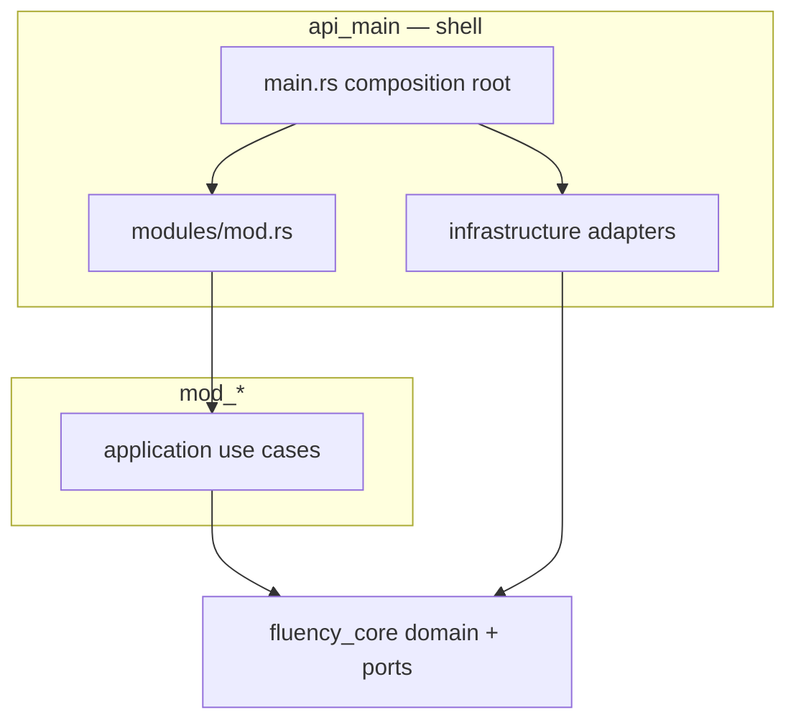
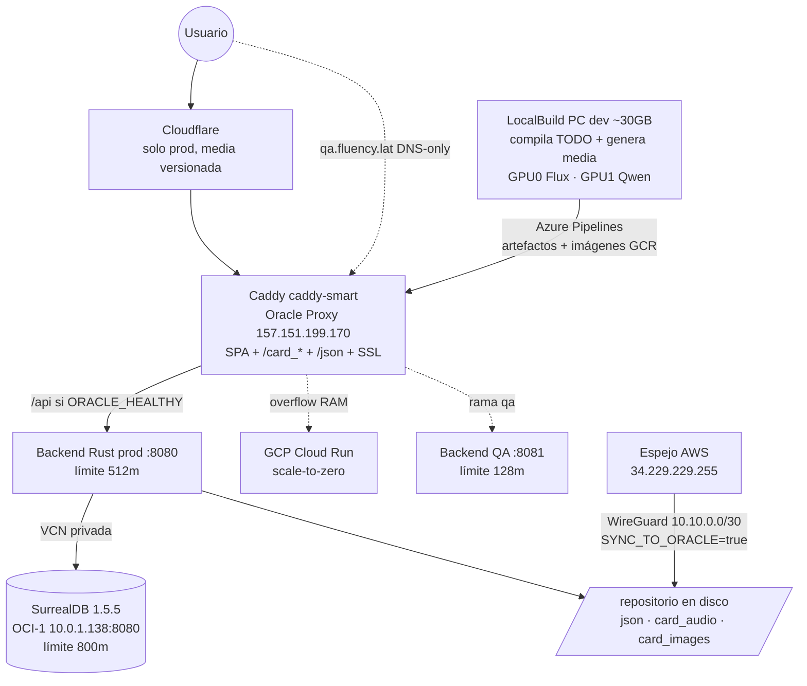

# Arquitectura Modular — Fluency

Documento canónico del modelo **Clean / Hexagonal modular** con **registry**, **sparse-checkout**, **conexión/desconexión de módulos** por capa y aplicación explícita de principios **SOLID**.

**Deploy / Git / Azure:** [`DEPLOY_Y_REPOSITORIO.md`](DEPLOY_Y_REPOSITORIO.md)

---

## 0. Contrato arquitectónico

Este repositorio sigue un contrato arquitectónico explícito. Si una persona o una IA entra al proyecto, debe asumir esto como verdad de diseño:

- El sistema es un **monolito modular**, no un frontend y backend acoplados por carpetas.
- La aplicación debe poder arrancar con el **shell compartido + cualquier subconjunto válido de módulos**.
- Un módulo ausente no debe romper **build, arranque, rutas, navegación ni composition root**.
- Los módulos se agregan o quitan por **registry**, **Cargo features**, **flags Vite** y **sparse-checkout**; no editando el shell para acoplar código directo.
- `git sparse-checkout` no es solo conveniencia de Git: es parte del diseño para que la IA vea en disco solo el shell y los módulos activos.
- El shell puede conocer la existencia de un módulo por su manifest o feature, pero no debe depender de detalles internos de módulos opcionales.
- Las dependencias deben ir hacia **puertos/contratos** y no hacia implementaciones concretas de otros módulos.

En términos de producto, el objetivo es que un sistema tipo ERP pueda entregar solo `inventario`, o `inventario + ventas`, sin arrastrar `compras`, `facturación` u otros módulos que el cliente no compró, y sin romper la aplicación.

### Reglas operativas

- Si un módulo no está en disco, el sistema debe omitir su registro.
- Si un módulo no está habilitado por feature o flag, el sistema debe compilar y correr sin él.
- El shell compartido es la pieza estable: auth, layout, health, config, registry y composition root.
- Cada módulo debe exponer un punto de integración claro y acotado:
  - Backend: feature + crate opcional + `register_routes(app)`.
  - Frontend: carpeta `client/src/modules/<modulo>/` + `index.jsx` como manifest.
- Ningún módulo debe ser requisito implícito de otro salvo que el contrato del registry lo declare de forma explícita.

---

## 1. Visión

El repositorio es un **monolito modular**:

| Pieza | Rol |
|-------|-----|
| **Shell compartido** | Arranque, auth, layout, tutor, health, notificaciones |
| **Módulos de negocio** | Flashcards, pronombres, futuros módulos vendibles |
| **Registry** | `scripts/module_registry.sh` — fuente de verdad de paths, features y flags |
| **Sparse-checkout** | Solo existen en disco los archivos del shell + módulos activos → la IA no ve código ajeno |

Objetivos de diseño:

- Conectar y desconectar módulos en **compile-time** (Cargo features) y **runtime** (flags Vite)
- Trabajar con **git sparse-checkout** para aislamiento físico de contexto
- Aplicar **SOLID** y **Ports & Adapters** en backend y mantener el frontend desacoplado mediante shell + registry modular
- Tolerar cambio de tecnología vía puertos (`fluency_core`)
- Mantenible y testeable por módulo

---

## 2. Mapa del repositorio

```
flashcard/
├── backend/
│   ├── core/                 # fluency_core — dominio + puertos compartidos
│   ├── mod_shell/            # casos de uso compartidos del shell (auth, tutor, presence, subscriptions)
│   ├── api_main/             # composition root (shell HTTP)
│   │   └── src/modules/      # registro de rutas por módulo
│   ├── mod_flashcards/       # casos de uso flashcards (deck, audio, imágenes, batch CLI)
│   │   └── src/batch/        # --batch-gen-images / --batch-gen-audio (composition desde main)
│   └── mod_pronoun/          # crate pronoun_practice — StoryUseCases
├── client/
│   └── src/
│       ├── modules/          # registry frontend (loader + módulos)
│       │   ├── index.js
│       │   ├── flashcards/   # ports, adapters, useCases, hooks, composition.js
│       │   └── pronounPractice/
│       ├── repositories/     # shell: AuthRepository (httpClient)
│       └── context/          # shell: UIContext, AuthContext, AppContext
├── scripts/
│   ├── module_registry.sh    # FUENTE DE VERDAD
│   ├── sparse-module.sh
│   ├── export-module.sh
│   └── validate-module.sh
└── modules/README.md           # resumen humano del registry
```

---

## 3. Backend — capas y registro

### 3.1 Capas (hexagonal)



| Capa | Ubicación | Responsabilidad |
|------|-----------|-----------------|
| Dominio + puertos | `backend/core` | Modelos y contratos (`StorageRepository`, `MediaDeliveryProvider`, `AITutor`, …) |
| Aplicación | `backend/mod_*` | Casos de uso por módulo y shell (`mod_shell`, `mod_flashcards`, `mod_pronoun`) |
| API | `backend/api_main/src/api/` | Handlers HTTP delgados; DTOs en `dto/`; mapeo HTTP→use case en `mappers/` |
| Infraestructura | `backend/api_main/src/infrastructure/` | Adapters por puerto: `storage/surreal/*`, entrega Oracle/Cloudflare, Gemini, ComfyUI, storage local |
| Composition root | `backend/api_main/src/main.rs` | Wiring de dependencias y `AppState` |
| Registro modular | `backend/api_main/src/modules/` | `register_routes()` por módulo |

### 3.2 Features Cargo (`api_main/Cargo.toml`)

```toml
[features]
default = ["flashcards", "auth"]
flashcards = ["mod_flashcards"]
auth = []
pronoun_practice = ["dep:pronoun_practice"]
```

| Módulo registry | Feature | Crate |
|-----------------|---------|-------|
| `flashcards` | `flashcards` | `mod_flashcards` |
| `pronoun` | `pronoun_practice` | `pronoun_practice` (`mod_pronoun/`) |

**Build solo pronombres:**

```bash
cargo build -p api_main --no-default-features --features auth,pronoun_practice
```

**Build solo flashcards:**

```bash
cargo build -p api_main --no-default-features --features auth,flashcards
```

### 3.3 Registro de rutas

Cada módulo expone `register_routes(app) -> Router` en `api_main/src/modules/`:

- `shell.rs` — media compartida `/card_images`, `/card_audio` (vía `StorageRepository`; **no** depende de flashcards)
- `flashcards.rs` — decks, generación/resolución de media, APIs de estudio
- `pronoun_practice.rs` — progreso, episodios, historias

El shell registra siempre: `/api/health`, `/api/features`, tutor, notificaciones, auth (si feature activa), **y media estática compartida**.

La política de entrega de esa media usa el puerto `MediaDeliveryProvider`. Los adaptadores Oracle y
Cloudflare se seleccionan en el composition root mediante `MEDIA_DELIVERY_MODE`; el handler no
contiene condicionales por proveedor. La guía operativa vive en
[`infrastructure/media-delivery-cache.md`](infrastructure/media-delivery-cache.md).

**Landing demo (TRY DEMO):** la UI vive en el módulo `landing` y comparte con el estudio normal los
puertos/adaptadores de media, el versionado, la precarga cancelable de la siguiente imagen/audio y
la política Oracle/Cloudflare. La precarga solo resuelve archivos existentes y nunca invoca IA; la
generación invitada visible (`category=landing-demo`) conserva Gemini/ElevenLabs. El perfil sparse
`flashcards` (rama `dev-flashcards`) incluye `landing` + `dashboard` + `flashcards`. Detalle operativo:
[`infrastructure/media-delivery-cache.md`](infrastructure/media-delivery-cache.md).

`TutorUseCases` usa `Option<PronounPracticeRepository>` — sin módulo pronoun no hay acoplamiento a su DB.

**Persistencia (ISP):** `SurrealConnection` comparte el cliente; cada puerto DB tiene su adapter (`SurrealUserRepository`, `SurrealCardProgressRepository`, `SurrealPronounRepository`, …) en `infrastructure/storage/surreal/`.

**Batch CLI:** la lógica masiva de imágenes/audio vive en `mod_flashcards/src/batch/`; `main.rs` solo compone `ImageBatchContext` / `AudioBatchContext` y delega.

**HTTP delgado:** `generation.rs` usa DTOs (`api/dto/generation.rs`) y mappers (`api/mappers/flashcards.rs`); los endpoints no importan tipos de `mod_flashcards` directamente.

---

## 4. Frontend — Clean / Hexagonal modular

El frontend replica la misma dinámica que el backend: **shell + módulos** con capas internas **ports → use cases → composition root → adapters**.

### 4.1 Mapa de capas por módulo

```
client/src/
├── context/              # shell: AuthContext, UIContext (solo UI global)
├── services/httpClient.js # adaptador HTTP compartido del shell
├── config/index.js       # flags Vite + apiUrl (shell)
└── modules/
    ├── index.js          # registry + composition root global
    ├── flashcards/
    │   ├── composition.js       # wiring: ports ← adapters(httpClient)
    │   ├── ports/               # contratos (equivalente fluency_core traits)
    │   ├── adapters/            # HTTP + media (equivalente infrastructure)
    │   ├── useCases/            # lógica pura de aplicación (deckUseCases, deckSessionUseCases)
    │   ├── hooks/               # orquestación React (useDeckSession)
    │   ├── queries/             # (solo si usa React Query)
    │   ├── domain/              # modelos/datos estáticos del módulo
    │   ├── config/              # config + i18n exclusiva (catalogOrder, sidebarLabels)
    │   ├── context/             # estado React del módulo
    │   ├── uiBridge.js          # puente shell↔módulo (FloatingMenu)
    │   └── index.jsx            # manifest del registry
    └── pronounPractice/
        ├── composition.js
        ├── ports/
        ├── adapters/
        ├── queries/storyQueries.js
        ├── domain/pronounReferenceData.js
        └── index.jsx
    ├── landing/              # página pública / (opt-in, layout bare)
    ├── pricing/              # precios y checkout público
    └── dashboard/            # shell autenticado + home /dashboard
        ├── DashboardShell.jsx
        ├── DashboardHome.jsx
        ├── layout/           # Sidebar, Header, Footer, FloatingMenu
        └── config/translations.js
```

| Capa frontend | Equivalente backend | Responsabilidad |
|---------------|---------------------|-----------------|
| `ports/` | `fluency_core::ports` | Contratos de datos/servicios |
| `useCases/` / `queries/` | `mod_*` | Orquestación de negocio |
| `adapters/` | `api_main/infrastructure` | HTTP, storage, APIs externas |
| `composition.js` | `api_main/main.rs` | Inyección de dependencias |
| `index.jsx` + `modules/index.js` | `api_main/modules/` | Registro de rutas y providers |
| `context/` (módulo) | handlers delgados | Estado de presentación |
| Shell `App.jsx` | composition root HTTP | Layout, auth, lab, registry |

### 4.2 Loader (`client/src/modules/index.js`)

Auto-descubre `./<modulo>/index.jsx` (sparse-checkout decide qué existe) y exporta:

- `initModules()` — carga async de manifests
- `getModuleRoutes(config)` — rutas React Router
- `getModuleNavSections(config, ctx)` — sidebar
- `getModuleOverlays(config)` — modales globales del módulo
- `getModuleFloatingMenuItems(config, ctx)` — menú flotante
- `getModuleShellProviders(config)` — providers que el módulo monta fuera de sus rutas (ej. `FlashcardUiProvider`)
- `getAuthenticatedHomePath(config)` — `/dashboard` o módulo default
- `getDefaultAppPath(config)` — ruta pública inicial

### 4.3 Contrato de un módulo frontend

```javascript
export default {
  id: 'miModulo',
  enabled: (config) => config.features.miModulo,
  routes: (config) => [{ path: '/ruta', element: <Page />, layout: 'app' | 'bare' }],
  appShell: DashboardShell,                     // solo módulo dashboard
  navSections: ({ language, config }) => [...],
  overlays: () => <MisOverlays />,              // opcional
  floatingMenuItems: (ctx) => [...],            // opcional
  shellProviders: (config) => [MiUiProvider],   // opcional
};
```

Layouts de ruta:

| `layout` | Uso |
|----------|-----|
| `bare` | Landing, login — sin sidebar |
| `app` | Dashboard home, módulos de estudio — dentro del shell dashboard (o `MinimalAppShell` si dashboard no está en disco) |

Flujo de datos (hexagonal):

```
Page → hooks → useCases/queries → port → adapter(httpClient)
```

### 4.4 Rutas y navegación

Config típica de desarrollo (`client/.env.development`):

```env
VITE_ENABLE_LANDING=true
VITE_ENABLE_DASHBOARD=true
VITE_DEFAULT_MODULE=flashcards
```

Flujo de URLs:

```
/              → Landing (público)
/login         → Login
/dashboard     → Home autenticado (hub)     ← destino tras login
/flashcard     → Módulo flashcards
/unknown       → AppFallback → /dashboard o /login
```

**Post-login:** `LoginPage` y `LandingPage` (usuario ya autenticado) llaman a `getAuthenticatedHomePath()`. Con dashboard activo devuelve **`/dashboard`**, no `/flashcard`.

**Resolución de rutas** (`client/src/modules/routingPaths.js` — testeable con `npm run test:routing`):

| Export | Rol |
|--------|-----|
| `DASHBOARD_HOME_PATH` | Constante `/dashboard` |
| `pickHomeRoute()` | Home del módulo default (`/` o `/flashcard` según landing) |
| `resolveAuthenticatedHomePath()` | Prefiere `/dashboard` si el módulo está registrado |
| `resolveFallbackPath()` | 404 dentro del shell → home autenticado |
| `shouldUseFlashcardLegacyAlias()` | Redirect `/flashcard` → `/` solo sin landing |

**Anti-bucles:** `SafeRedirect` no navega si `to === pathname`. `DashboardShell` mantiene **siempre** la misma jerarquía DOM (sidebar + `<Outlet />`); no condicionar el layout completo al estado de carga — remontar el árbol provocaba bucles infinitos de fetch a `/api/categories`.

### 4.5 Shell frontend (`App.jsx`)

El shell **no importa** páginas ni repositorios de módulos. Solo:

- Layout (Sidebar, Header, Footer, FloatingMenu)
- Rutas de laboratorio/admin (`/admin`, `/grammar`, `/test`)
- `getAppRoutes`, `getModuleOverlays`, `getModuleShellProviders`

Reglas de aislamiento (Jun 2026):

- Estado UI de un módulo vive en su `context/` (ej. `FlashcardUiContext`), **no** en `UIContext` del shell.
- Config de dominio vive en `modules/<nombre>/config/` (ej. `catalogOrder`, `translations`, `sidebarLabels`), no en `client/src/config/`.
- `client/src/config/translations.js` solo contiene i18n del **shell** (admin, pronunciación en FloatingMenu, cuenta).
- Cada módulo exporta sus etiquetas de navegación vía `get*SidebarLabels(language)`; el registry pasa `language`, no el objeto `t` del shell.
- El shell expone `httpClient`; todos los adapters HTTP (incl. `AuthRepository`) lo usan.
- `uiBridge.js` permite al FloatingMenu invocar acciones del módulo sin acoplar imports cruzados.

### 4.6 Flags Vite (`client/src/config/index.js`)

| Flag | Comportamiento |
|------|----------------|
| `VITE_ENABLE_LANDING` | Opt-in (`=== 'true'`) — `/` público (landing) |
| `VITE_ENABLE_DASHBOARD` | Opt-out (`!== 'false'`) — shell + home `/dashboard` tras login |
| `VITE_DEFAULT_MODULE` | Módulo que abre en `/` si no hay landing (`flashcards` default, o `pronoun`) |
| `VITE_ENABLE_FLASHCARDS` | Opt-out (`!== 'false'`) |
| `VITE_ENABLE_PAYMENTS` | Opt-out (`!== 'false'`) — habilita módulo `pricing` |
| `VITE_ENABLE_PRONOUN_REFERENCE` | Opt-out |
| `VITE_ENABLE_PRONOUN_PRACTICE` | Opt-in (`=== 'true'`) |
| `VITE_ENABLE_PRONOUN` | Alias legacy de práctica |

---

## 5. Registry y sparse-checkout

### 5.1 Fuente de verdad

`scripts/module_registry.sh` define por módulo:

- `module_backend_feature`
- `module_frontend_flag`
- `module_cargo_build_args`
- `shared_sparse_patterns` — shell mínimo
- `module_sparse_patterns` — archivos exclusivos del módulo

### 5.2 Comandos

```bash
# Listar módulos
./scripts/sparse-module.sh list

# Trabajar solo con pronombres (archivos de flashcards ausentes en disco)
./scripts/sparse-module.sh pronoun

# Trabajar con dos módulos
./scripts/sparse-module.sh flashcards pronoun

# Restaurar repo completo
./scripts/sparse-module.sh full

# Exportar entrega
./scripts/export-module.sh flashcards

# Validar compilación del módulo
./scripts/validate-module.sh pronoun
```

### 5.3 Aislamiento para IA

Tras `./scripts/sparse-module.sh pronoun`:

- **Existen:** `backend/core`, `api_main`, `mod_shell`, `mod_pronoun`, `client/src/modules/pronounPractice`, shell
- **No existen:** `mod_flashcards`, `client/src/modules/flashcards`, `json/`

Cursor y herramientas de indexación solo ven lo presente físicamente.

---

## 6. Agregar un módulo nuevo

### Backend

1. Crear `backend/mod_<nombre>/` con casos de uso que dependan solo de `fluency_core`
2. Añadir al workspace en `backend/Cargo.toml`
3. Dependencia opcional + feature en `backend/api_main/Cargo.toml`
4. Crear `backend/api_main/src/modules/<nombre>.rs` con `register_routes`
5. Registrar en `api_main/src/modules/mod.rs`

### Frontend

1. Crear `client/src/modules/<nombre>/index.jsx` con el contrato del §4.2
2. Colocar página, context, repositorios, componentes UI y servicios específicos dentro del módulo
3. Añadir flag `VITE_ENABLE_<NOMBRE>` en `client/src/config/index.js`

### Registry

1. Añadir nombre a `MODULE_NAMES` en `module_registry.sh`
2. Implementar `module_*` case arms
3. Documentar fila en `modules/README.md`
4. Crear wrapper `scripts/sparse-<nombre>.sh` (opcional)

### Validar

```bash
./scripts/sparse-module.sh <nombre>
./scripts/validate-module.sh <nombre>
```

---

## 7. Quitar un módulo

### Desconectar (sin borrar código)

1. Apagar flags frontend
2. Compilar sin feature: `cargo build -p api_main --no-default-features --features auth,<otros>`
3. Usar sparse-checkout del módulo en el que trabajes

### Eliminar físicamente

1. Quitar feature y dependencia de `api_main/Cargo.toml`
2. Quitar del workspace `backend/Cargo.toml`
3. Quitar `modules/<nombre>.rs` y entrada en `mod.rs`
4. Quitar de `module_registry.sh` y `modules/README.md`
5. Borrar carpetas `mod_<nombre>` y `client/src/modules/<nombre>`

---

## 8. Principios SOLID aplicados

| Principio | Cómo se aplica |
|-----------|----------------|
| **SRP** | Casos de uso en `mod_*`; shell solo compone. Frontend: `useCases/` + `queries/` por módulo |
| **OCP** | Nuevo módulo = nuevo crate/carpeta + registro; nuevo proveedor de media = nuevo adaptador |
| **LSP** | `NullDbRepository` cuando Surreal no está disponible |
| **ISP** | Puertos separados por responsabilidad en `core`, `modules/*/ports/` y adapters Surreal por trait |
| **DIP** | Use cases y handlers dependen de traits/ports; proveedores se eligen en el composition root |

Notas de alcance:

- La aplicación de `SOLID` es **simétrica** en backend y frontend desde Jun 2026: ambos usan ports/adapters/composition.
- En **frontend**, `UIContext` del shell solo contiene UI global (sidebar, idioma, mensajes). Estado de negocio/UI de módulo → `FlashcardUiContext`, etc.
- Los archivos de estilos grandes no cambian la arquitectura base; sí señalan deuda visual en ciertos módulos.

### 8.1 Desviaciones conocidas (auditoría 2026-07-14 — NO "arreglar" de pasada)

Verificado con grep sobre el código real (misma filosofía que `client/CLAUDE.md` §9): `core` está
limpio (solo dominio + puertos); `api_main/src/domain` es una fachada de re-exports de
`fluency_core` (no es violación). Quedan desviaciones aceptadas que requieren refactor planificado
(tocan auth/presencia de producción o el pipeline de media probado/optimizado, nunca fix oportunista):

1. **`mod_shell/src/auth.rs`**: usa `reqwest` (JWKS/tokeninfo de Google) y `jsonwebtoken`
   directamente dentro del crate de casos de uso. Estricto sería un puerto `TokenVerifier` en
   `core` + adaptador en `api_main/src/infrastructure`. Riesgo del refactor: flujo de login prod.
2. **`mod_shell/src/presence_use_cases.rs`**: `reqwest::Client` embebido en el caso de uso
   (mismo patrón y mismo tratamiento).
3. **`mod_flashcards/src/image_use_cases.rs` (~línea 642)**: escribe `../image_generation.log`
   con `std::fs` (ruta relativa al CWD) dentro del caso de uso. Estricto sería un puerto de
   telemetría/logging. Es parte del pipeline de imágenes optimizado y probado — no tocar de pasada.
4. **`mod_flashcards/src/batch/audio.rs`**: append de `batch_audio_failures.log` con `std::fs`
   en la capa de aplicación (contexto CLI batch; la ruta sí viene de config, no hardcodeada).

Matiz aceptado (no es desviación de capa): `api_main/src/api/endpoints/generation.rs` importa la
**función** `mod_flashcards::is_landing_demo_namespace` (predicado de dominio, no un tipo); la regla
"HTTP delgado" del §3.3 se refiere a tipos de request/response, que sí pasan por DTOs y mappers.

## 9. Módulos actuales

Ver tabla actualizada en [modules/README.md](../modules/README.md).
Plano detallado de cada módulo (contratos, mapa de archivos, invariantes): [docs/modules/](modules/).

## 9b. Plano de conjunto (C4 — contenedores)



Cada caja de módulo del frontend/backend se detalla en su plano de [docs/modules/](modules/);
los datos de máquina (IPs, RAM, specs) son canónicos en
[infrastructure/server_inventory.md](infrastructure/server_inventory.md).

---

## 10. Documentos relacionados (no arquitectura modular)

- Infraestructura y deploy: `docs/infrastructure/pipeline-and-deploy.md`
- Entrega Oracle/Cloudflare y caché de media: `docs/infrastructure/media-delivery-cache.md`
- Integración de sistemas externos (IA, Caddy, Surreal): `docs/INTEGRACION_SISTEMA.md`
- Mapa por dominio funcional: `docs/MAPA_DOMINIOS.md`
