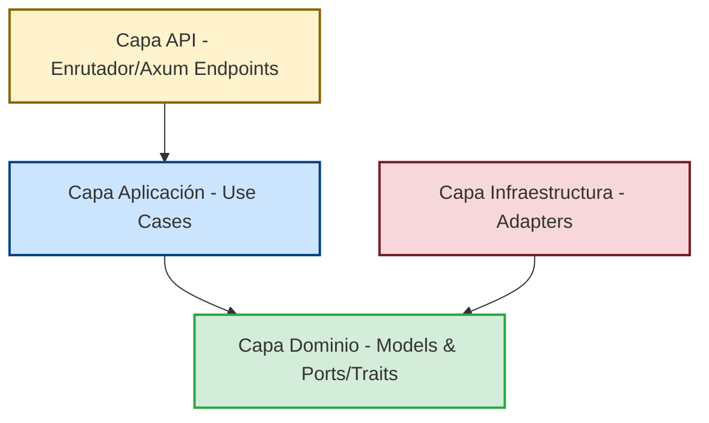
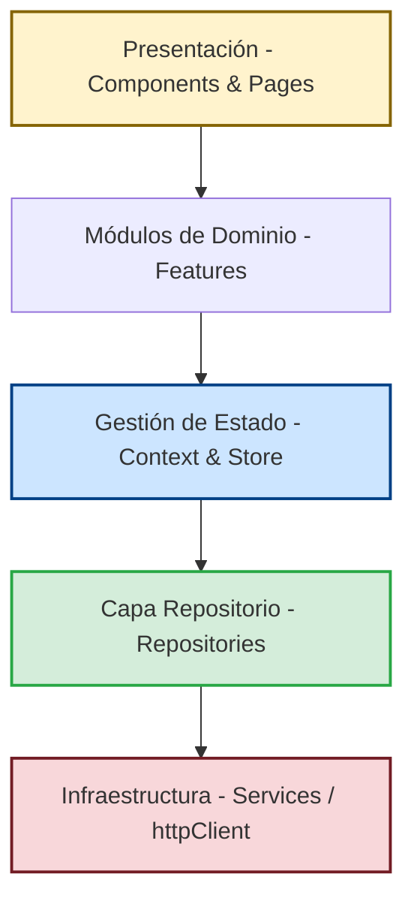

# Arquitectura del Sistema — Flashcard AI (Análisis de Código)

Este documento describe la arquitectura de software implementada en Flashcard AI, abarcando tanto el backend en Rust como el frontend en React. El sistema está diseñado bajo el paradigma de **Arquitectura Limpia (Clean Architecture / Ports & Adapters)**, aplica estrictamente los principios **SOLID**, y provee un ecosistema modular fuertemente desacoplado.

---

## 1. Arquitectura Limpia (Backend)

El código fuente en `backend/src/` está organizado de tal forma que las dependencias fluyen estrictamente **hacia adentro**. La lógica del dominio de negocio no tiene conocimiento de las bases de datos, librerías de red ni frameworks web.



### Capa 1: Dominio (Domain) — El Núcleo Sintáctico
Contiene las entidades puras del sistema y las definiciones de los puertos (interfaces). No tiene dependencias externas.
*   **Modelos de Datos (`backend/src/domain/models/`):** [flashcard.rs](file:///home/jcoronado/Desktop/dev/flashcard/backend/src/domain/models/flashcard.rs), [story.rs](file:///home/jcoronado/Desktop/dev/flashcard/backend/src/domain/models/story.rs), [user.rs](file:///home/jcoronado/Desktop/dev/flashcard/backend/src/domain/models/user.rs).
*   **Puertos/Traits (`backend/src/domain/repositories/`):** Define contratos asíncronos como `UserRepository`, `StorageRepository` o `AITutor` en [db_repository.rs](file:///home/jcoronado/Desktop/dev/flashcard/backend/src/domain/repositories/db_repository.rs).

### Capa 2: Aplicación (Application) — Orquestación de Casos de Uso
Coordinan el flujo de datos utilizando únicamente las abstracciones (traits) del dominio.
*   **Ubicación:** `backend/src/application/use_cases/`
*   **Ejemplo:** [deck_use_cases.rs](file:///home/jcoronado/Desktop/dev/flashcard/backend/src/application/use_cases/deck_use_cases.rs). Orquesta operaciones y delega errores mediante `anyhow::Result`, sin conocer la existencia de HTTP o JSON.

### Capa 3: API / Entrega (Delivery) — El Framework
Punto de entrada de la red (HTTP/REST) usando `axum`.
*   **Ubicación:** `backend/src/api/`
*   Define endpoints en [decks.rs](file:///home/jcoronado/Desktop/dev/flashcard/backend/src/api/endpoints/decks.rs) e implementa middlewares de autenticación ([middleware/auth.rs](file:///home/jcoronado/Desktop/dev/flashcard/backend/src/api/middleware/mod.rs)).

### Capa 4: Infraestructura (Infrastructure) — Los Adaptadores
Implementaciones concretas de los puertos del Dominio.
*   **Ubicación:** `backend/src/infrastructure/`
*   [surreal_repository.rs](file:///home/jcoronado/Desktop/dev/flashcard/backend/src/infrastructure/storage/surreal_repository.rs) implementa los traits de base de datos vía WebSockets.
*   [gemini_grpc_provider.rs](file:///home/jcoronado/Desktop/dev/flashcard/backend/src/infrastructure/ai/gemini_grpc_provider.rs) implementa `AITutor` vía gRPC.

---

## 2. Aplicación Práctica de los Principios SOLID (Backend)

*   **S — Single Responsibility:** Casos de uso fuertemente segmentados (Audio, Imágenes, Decks).
*   **O — Open/Closed:** Abierto a extensión agregando adaptadores a la carpeta `infrastructure` (ej. cambiar DALL-E por ComfyUI creando un nuevo implementador de `ImageGenerator`).
*   **L — Liskov Substitution:** Patrón *Null Object* aplicado exhaustivamente (ej. [null_db_repository.rs](file:///home/jcoronado/Desktop/dev/flashcard/backend/src/infrastructure/storage/null_db_repository.rs) se inyecta y ejecuta silenciosamente sin fallar si SurrealDB está offline).
*   **I — Interface Segregation:** Rasgos de bases de datos divididos y granulares (ej. `UserRepository` no fuerza la implementación de progresos de flashcards).
*   **D — Dependency Inversion:** Las capas de Aplicación y API dependen de *Traits*, no de implementaciones (inyectado en el Composition Root [main.rs](file:///home/jcoronado/Desktop/dev/flashcard/backend/src/main.rs)).

---

## 3. Desacoplamiento y Modularidad (Backend Plug & Play)

El sistema aprovecha **Cargo Features** para exclusión de código en tiempo de compilación.
En [Cargo.toml](file:///home/jcoronado/Desktop/dev/flashcard/backend/Cargo.toml):
```toml
[features]
story_arcade = []
subscriptions = ["payments"]
```
Y en [main.rs](file:///home/jcoronado/Desktop/dev/flashcard/backend/src/main.rs):
```rust
#[cfg(feature = "story_arcade")]
pub story_use_cases: Arc<StoryUseCases>,
```
Si se compila sin la feature `story_arcade`, toda la lógica, los endpoints de Axum y las dependencias de IA asosiadas quedan excluidas del binario final. Además, implementa degradación elegante en tiempo de ejecución (si no hay BD, el sistema omite el registro y carga las tarjetas localmente).

---

## 4. Arquitectura del Cliente (Frontend en React)

El código del cliente (`client/src/`) adopta principios análogos de la **Arquitectura Limpia y Modularidad** adaptados al ecosistema React. La UI de presentación no interactúa con infraestructura directamente, y las responsabilidades están estrictamente delimitadas por directorios.



### 4.1. Separación de Responsabilidades en el Cliente

La aplicación está dividida en las siguientes capas lógicas:

#### A. Capa de Servicios de Infraestructura (`services/`)
Provee abstracciones técnicas de bajo nivel totalmente agnósticas de la UI.
*   **Ejemplo Central:** [httpClient.js](file:///home/jcoronado/Desktop/dev/flashcard/client/src/services/httpClient.js). Es el **único lugar del sistema** donde se utiliza la API nativa de `fetch`. Se encarga de interceptar llamadas globales, inyectar el token JWT (`Authorization: Bearer ...`) y parsear respuestas estándar. Si en un futuro se migra a `axios` o GraphQL, el cambio ocurriría exclusivamente aquí.
*   **Módulos Externos:** Integraciones como el [imageCompressionService.js](file:///home/jcoronado/Desktop/dev/flashcard/client/src/services/imageCompressionService.js) que se apoya en binarios de WebAssembly (`wasm_lib_bg.wasm`) para operaciones pesadas, manteniendo el hilo de UI limpio.

#### B. Capa de Repositorios / Adaptadores de API (`repositories/`)
Constituye el contrato (análogo a los puertos) por los cuales el cliente interactúa con el exterior. Las pantallas de React no saben cuáles son las URLs REST ni cómo se construye un payload JSON.
*   **Ejemplos:** [flashcardRepository.js](file:///home/jcoronado/Desktop/dev/flashcard/client/src/repositories/flashcardRepository.js), [AuthRepository.js](file:///home/jcoronado/Desktop/dev/flashcard/client/src/repositories/AuthRepository.js).
*   Exportan simples objetos funcionales que delegan las promesas a `httpClient.js`. 
    ```javascript
    // UI no conoce /api/categories. Solo llama a fetchCategories()
    fetchCategories: () => httpClient.get('/api/categories')
    ```

#### C. Capa de Gestión de Estado y Lógica de Casos de Uso (`context/` & `store/`)
Actúa como la capa de "Casos de Uso" en el lado del cliente. Coordina cuándo recuperar información de los repositorios y expone métodos de negocio a la interfaz de usuario.
*   **Contextos (Providers):** [FlashcardContext.jsx](file:///home/jcoronado/Desktop/dev/flashcard/client/src/context/FlashcardContext.jsx) o [AuthContext.jsx](file:///home/jcoronado/Desktop/dev/flashcard/client/src/context/AuthContext.jsx). Mantienen el estado reactivo global. 
*   **Store (Zustand):** [useGameStore.js](file:///home/jcoronado/Desktop/dev/flashcard/client/src/store/useGameStore.js). Mantiene el estado complejo local aislado de las jerarquías largas de componentes React.

#### D. Capa de Presentación Modular (`features/`, `components/`, `pages/`)
La capa de presentación que renderiza la experiencia en el DOM virtual.
*   **`features/`:** La organización es orientada a dominio (Domain-Driven Design). Cada característica principal (ej. `flashcards/`, `reference/`) agrupa internamente sus componentes y subrutas específicas. Esto previene acoplamiento (un "God Component") y facilita eliminar módulos enteros (Plug & Play visual) simplemente borrando la carpeta si la funcionalidad es deprecada.
*   **`components/` & `pages/`:** Los componentes son tontos y reutilizables. Solo renderizan propiedades recibidas o interactúan con la capa de `context/`.

### 4.2. Cumplimiento de Principios (Frontend)

*   **S — Single Responsibility:** Cada archivo de repositorio maneja un solo contexto (Autenticación separada de Flashcards). Los servicios de infraestructura (WebAssembly de imágenes) no procesan estado de UI.
*   **D — Dependency Inversion:** Las páginas (`pages/`) dependen de Contextos (`context/`) e importan funciones nominales de los Repositorios (`repositories/`); nunca manejan librerías directas de red o implementaciones técnicas de bajo nivel. El estado asíncrono se inyecta desde arriba.
