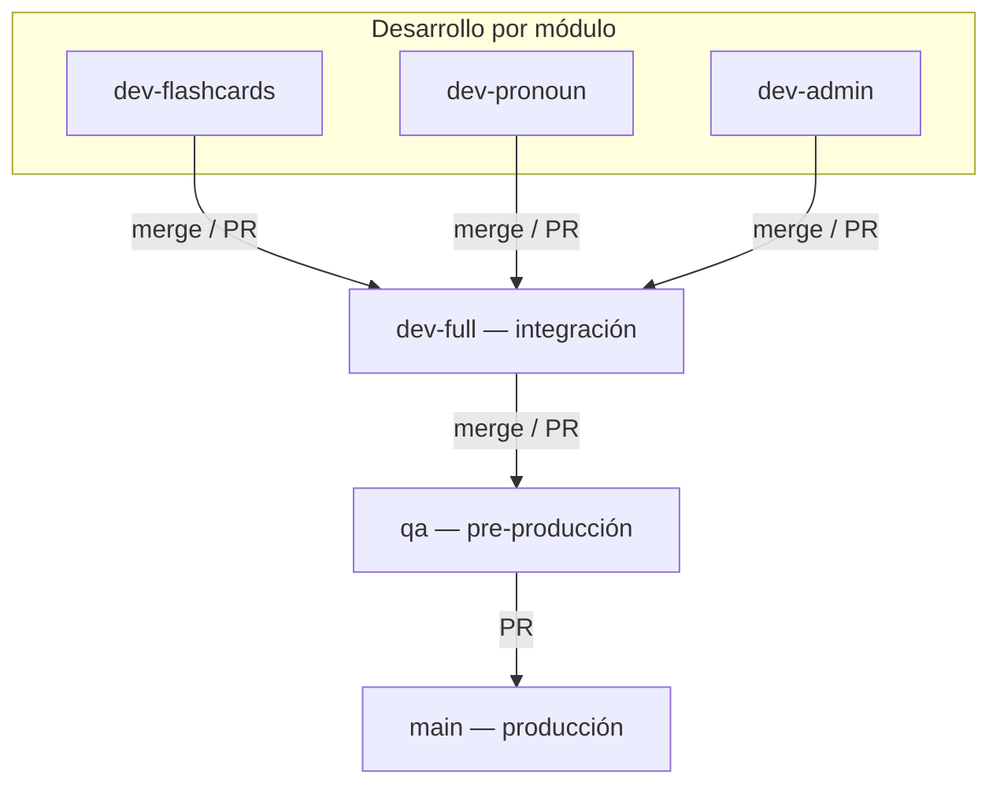

# Ramas Git — Fluency

> **Fuente de verdad:** flujo modular `dev-*` → `dev-full` → `qa` → `main`.  
> Cada rama `dev-<módulo>` va pareada con su perfil **sparse** en disco.

**Repo:** `https://github.com/jcoronado1982/http-fluency.lat.git`

---

## Modelo de ramas



| Rama Git | Perfil sparse pareado | Rol | Deploy |
|----------|----------------------|-----|--------|
| **`dev-flashcards`** | `./scripts/sparse-module.sh flashcards` | Trabajo aislado flashcards | No |
| **`dev-pronoun`** | `./scripts/sparse-module.sh pronoun` | Trabajo aislado pronombres | No |
| **`dev-admin`** | `./scripts/sparse-module.sh admin` | Shell + admin | No |
| **`dev-full`** | `./scripts/sparse-module.sh full` | **Integración** — todo mergeado antes de QA | No |
| **`qa`** | `full` (validar integrado) | Pre-prod | Sí → `qa.fluency.lat` |
| **`main`** | — | Producción | Sí → `fluency.lat` |

---

## Flujo recomendado (por módulo)

```bash
# 1. Rama + sparse del mismo módulo
git checkout dev-flashcards
git pull origin dev-flashcards
./scripts/sparse-module.sh flashcards    # IA y editor solo ven flashcards

# 2. Trabajar, validar
./scripts/validate-module.sh flashcards
cargo check --manifest-path backend/Cargo.toml

# 3. Commit en la rama del módulo
git add -A && git commit -m "feat(flashcards): ..."
git push origin dev-flashcards

# 4. Integrar en dev-full
git checkout dev-full
git pull origin dev-full
git merge dev-flashcards
./scripts/sparse-module.sh full
./scripts/validate-module.sh flashcards   # repetir por cada módulo tocado
git push origin dev-full
```

Cambias de módulo:

```bash
git checkout dev-pronoun
./scripts/sparse-module.sh pronoun
```

---

## Escalar a QA y producción

```bash
# Antes de QA: siempre desde dev-full con repo completo en disco
git checkout dev-full
./scripts/sparse-module.sh full
cargo check --manifest-path backend/Cargo.toml
cd client && npm run build && cd ..

git checkout qa && git pull origin qa
git merge dev-full
git push origin qa          # pipeline → qa.fluency.lat

# Producción: PR qa → main (ver QA_TO_PROD_FLOW.md)
```

---

## Wrappers sparse (mismo mapeo)

| Script rápido | Perfil | Rama Git sugerida |
|---------------|--------|-------------------|
| `./scripts/sparse-flashcards.sh` | flashcards | `dev-flashcards` |
| `./scripts/sparse-pronoun.sh` | pronoun | `dev-pronoun` |
| `./scripts/sparse-admin.sh` | admin | `dev-admin` |
| `./scripts/sparse-full.sh` | full | `dev-full` |

---

## Reglas

1. **No push directo a `main`** — solo PR desde `qa`.
2. **`dev-full` es la única rama dev que mergea a `qa`.**
3. **Rama Git + sparse deben coincidir** (ej. `dev-flashcards` + `sparse-module.sh flashcards`).
4. **`sparse full` en disco** antes de merge a `qa`, aunque estés en rama `dev-full`.

---

## Ramas obsoletas

| Rama | Estado |
|------|--------|
| `dev` | Renombrada → **`dev-full`** |
| `refactor/arquitectura-workspaces` | Integrada; eliminada |

---

## Resumen

**Trabajas en `dev-<módulo>` → integras en `dev-full` → pruebas en `qa` → usuarios en `main`.**

Ver también: [GIT_SPARSE_WORKFLOW.md](GIT_SPARSE_WORKFLOW.md), [ARQUITECTURA_MODULAR.md](ARQUITECTURA_MODULAR.md).
