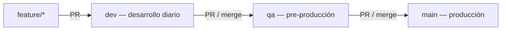

# Ramas Git — Fluency

> **Fuente de verdad** del flujo `dev` → `qa` → `main`.  
> No confundir con perfiles **sparse** (`full`, `flashcards`, …) — esos son locales en disco, no ramas.

---

## Modelo de ramas



| Rama | Rol | Deploy automático | URL |
|------|-----|-------------------|-----|
| **`dev`** | **Rama principal de desarrollo** — todo el trabajo diario y merges de features | No | — |
| **`qa`** | Integración y pruebas antes de prod | Sí (pipeline Azure) | `qa.fluency.lat` |
| **`main`** | Producción estable | Sí (pipeline Azure) | `fluency.lat` |

**Repo:** `https://github.com/jcoronado1982/http-fluency.lat.git`

---

## Flujo diario

```bash
# 1. Trabajar siempre en dev (o feature/* → dev)
git checkout dev
git pull origin dev

# 2. Opcional: aislar módulo en disco (NO es una rama Git)
./scripts/sparse-module.sh flashcards   # o pronoun, admin
./scripts/sparse-module.sh full         # repo completo en disco antes de release

# 3. Validar
cargo check --manifest-path backend/Cargo.toml
./scripts/validate-module.sh flashcards

# 4. Commit y push a dev
git add -A && git commit -m "feat: ..."
git push origin dev
```

---

## Promover a QA

Cuando `dev` está estable y probado localmente:

```bash
git checkout qa
git pull origin qa
git merge dev
git push origin qa
```

O **Pull Request** `dev` → `qa` en GitHub / Azure DevOps.

El pipeline `jcoronado1982.fluency` se dispara en push a `qa` y despliega en pre-prod.

---

## Promover a producción

Ver [QA_TO_PROD_FLOW.md](QA_TO_PROD_FLOW.md): **PR `qa` → `main`**, nunca push directo a `main`.

---

## Ramas históricas / feature

| Rama | Estado |
|------|--------|
| `refactor/arquitectura-workspaces` | **Integrada** — arquitectura modular ya en `dev`/`qa`/`main`; no usar |
| `feature/*` | Corta vida — merge a `dev` y borrar |

---

## Sparse `full` ≠ rama Git

```bash
./scripts/sparse-module.sh full   # todos los archivos en tu working copy
```

Eso **no** crea ni cambia la rama `dev`. Solo afecta qué carpetas ves en disco para desarrollar o validar antes de merge a `qa`.

---

## Resumen en una frase

**Desarrollas en `dev`, pruebas integradas en `qa`, usuarios finales en `main`.**
