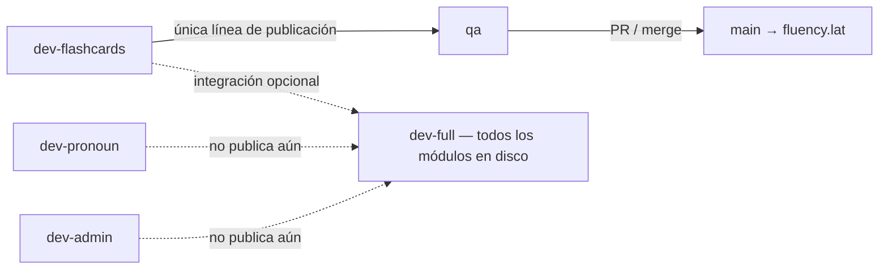

# Ramas Git — Fluency

> **Repo:** `https://github.com/jcoronado1982/http-fluency.lat.git`  
> Cada rama `dev-<módulo>` va pareada con su perfil **sparse** en disco.

---

## Qué se publica (Jun 2026)



| Rama | Rol | ¿Publica? |
|------|-----|-----------|
| **`dev-flashcards`** | Producto flashcards — trabajo y **releases** | **Sí** → `qa` → `main` |
| **`dev-full`** | Monorepo completo en disco, **todos los módulos activos** para desarrollar/validar | **No** (no merge directo a `qa` por ahora) |
| **`dev-pronoun`** / **`dev-admin`** | Módulos en preparación | **No** (aún) |
| **`qa`** | Pre-producción | Deploy → `qa.fluency.lat` |
| **`main`** | Producción | Deploy → `fluency.lat` |

**Regla actual:** lo que llega a usuarios es lo probado en **`dev-flashcards`**, sincronizado a **`qa`** y luego **`main`**. Pronoun y admin viven en `dev-full` / sus ramas hasta que decidas publicarlos.

---

## Modelo en disco (sparse)

| Rama Git | Perfil sparse | Qué hay en disco |
|----------|---------------|------------------|
| `dev-flashcards` | `./scripts/sparse-module.sh flashcards` | Shell + flashcards (pronoun **no existe** en disco) |
| `dev-pronoun` | `./scripts/sparse-module.sh pronoun` | Shell + pronoun |
| `dev-full` | `./scripts/sparse-module.sh full` | **Todo** — todos los módulos y crates |

---

## Flujo diario (flashcards)

```bash
git checkout dev-flashcards
./scripts/dev-module.sh flashcards   # rama + sparse

# trabajar, validar
./scripts/validate-module.sh flashcards

git commit && git push origin dev-flashcards
```

## Flujo full (integración local — todos los módulos)

```bash
git checkout dev-full
./scripts/sparse-module.sh full

# Validar monorepo completo; pronoun + flashcards en disco
cargo check --manifest-path backend/Cargo.toml
cd client && npm run build
```

Opcional: mergear `dev-flashcards` en `dev-full` para tener el mismo código con todos los módulos visibles:

```bash
git checkout dev-full && git merge dev-flashcards
```

---

## Publicar (solo desde dev-flashcards)

```bash
git checkout dev-flashcards
git pull origin dev-flashcards
./scripts/validate-module.sh flashcards

git checkout qa && git pull origin qa
git merge dev-flashcards
git push origin qa                    # pipeline → qa.fluency.lat

# Tras probar QA:
git checkout main && git pull origin main
git merge qa
git push origin main                  # pipeline → fluency.lat
```

**No usar `dev-full → qa`** mientras solo flashcards esté en producción.

---

## Wrappers sparse

| Script | Perfil | Rama |
|--------|--------|------|
| `./scripts/dev-module.sh flashcards` | flashcards | `dev-flashcards` |
| `./scripts/dev-module.sh pronoun` | pronoun | `dev-pronoun` |
| `./scripts/dev-module.sh full` | full | `dev-full` |

---

## Reglas

1. **Publicación actual:** solo `dev-flashcards` → `qa` → `main`.
2. **`dev-full`** = todos los módulos en disco; no es la rama de release.
3. **Rama Git + sparse deben coincidir** en trabajo diario.
4. **Sparse poda** módulos inactivos del disco (`sparse-cargo-sync.sh`); `full` restaura todo.
5. **No push directo a `main`** sin pasar por `qa`.

---

## Estado sincronizado (último release)

Todas las ramas de release apuntan al mismo commit cuando flashcards se publicó:

- `dev-flashcards`, `qa`, `main` → mismo tip (`3d3b67e2` al sincronizar)
- `dev-full` puede ir igual en código, pero su uso es **full en disco**, no publicar

Ver también: [GIT_SPARSE_WORKFLOW.md](GIT_SPARSE_WORKFLOW.md), [QA_TO_PROD_FLOW.md](QA_TO_PROD_FLOW.md).
