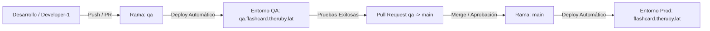

# Flujo de Despliegue: De QA a Producción

Este documento detalla el procedimiento estándar y seguro para promover cambios que ya han sido probados y validados en el entorno de **QA** (`https://qa.flashcard.theruby.lat`) hacia el entorno de **Producción** (`https://flashcard.theruby.lat`).

---

## 🔄 Resumen del Flujo de Trabajo (Git Branching)

El repositorio utiliza un modelo de ramas protegido para evitar caídas en producción:

---

## 📋 Procedimiento Paso a Paso

### Paso 1: Validación en QA
Antes de mover cualquier código a producción, asegúrate de que el comportamiento en el entorno de QA sea el esperado:
1. Navega a [https://qa.flashcard.theruby.lat](https://qa.flashcard.theruby.lat).
2. Realiza pruebas funcionales de la nueva característica o corrección.
3. Verifica que las llamadas a la API y el almacenamiento en la base de datos (`qa_flashcard` en SurrealDB) funcionen correctamente.

---

### Paso 2: Crear una Pull Request (PR) en Azure DevOps
Para pasar el código de la rama `qa` a la rama `main`, utiliza la plataforma de Azure DevOps para mantener un historial limpio y realizar revisiones.

1. Entra a tu proyecto en **Azure DevOps**.
2. Ve a la sección **Repos** > **Pull Requests**.
3. Haz clic en **New Pull Request** (Nueva Pull Request).
4. Configura las ramas de la siguiente manera:
   * **Source branch (Rama Origen):** `qa`
   * **Target branch (Rama Destino):** `main`
5. Escribe un título descriptivo (ej. `feat: agregar sistema de traducción probado en QA`).
6. Revisa la pestaña **Files** (Archivos) para dar una última inspección visual a los cambios de código.
7. Haz clic en **Create** (Crear).

---

### Paso 3: Completar el Merge
Una vez que estés seguro de los cambios:
1. Dentro de la Pull Request en Azure DevOps, haz clic en **Approve** (Aprobar).
2. Haz clic en el botón **Complete** (Completar).
3. Selecciona la opción de merge recomendada (por ejemplo, **Merge (no fast-forward)** o **Squash commit** para mantener la historia de commits limpia).
4. Haz clic en **Complete merge**.

---

### Paso 4: Despliegue Automático y Monitoreo (CI/CD)
Al completarse el Merge en la rama `main`, el Azure Pipeline iniciará un despliegue de forma totalmente automática.

1. El pipeline detectará que el cambio ocurrió en `main`.
2. **Despliegue Multi-Nube:** A diferencia de QA, el pipeline desplegará de forma paralela en:
   * **Oracle Server** (Servidor Principal en el puerto `8080`).
   * **AWS Mirror** (Servidor espejo).
   * **OCI-1 Mirror** (Servidor espejo).
3. Monitorea la ejecución en **Pipelines** > **Runs** dentro de Azure DevOps para cerciorarte de que todas las etapas finalicen con éxito (`succeeded`).

---

### Paso 5: Verificación en Producción
Una vez que el pipeline termine con éxito:
1. Entra a [https://flashcard.theruby.lat](https://flashcard.theruby.lat).
2. Comprueba que los cambios estén aplicados correctamente en vivo.

---

## ⚠️ Consideraciones de Seguridad y Buenas Prácticas

> [!IMPORTANT]
> **No hagas Push directo a la rama `main`**
> La rama `main` representa lo que está viendo el usuario final. Al usar Pull Requests desde `qa`, reduces a cero la posibilidad de romper producción por un error tipográfico o de configuración.

> [!NOTE]
> **Aislamiento de Base de Datos**
> Recuerda que la base de datos de producción (`flashcard`) es independiente de la de QA (`qa_flashcard`). Si tus cambios requerían de alguna migración de datos o inserción inicial manual, asegúrate de tenerla lista en producción antes de completar el merge.
