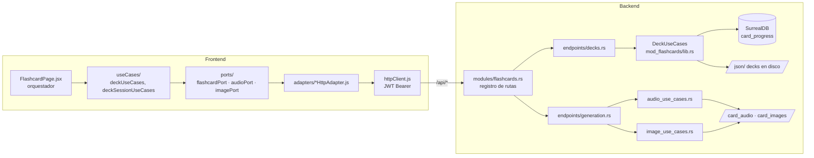

# Módulo `flashcards` — Estudio con tarjetas

## Propósito

Módulo principal del producto: estudio de vocabulario con flashcards por categorías gramaticales
y pares de idiomas (es_en, en_es, en_fr…), con progreso por usuario (SRS), audio TTS (.ogg Opus)
e imágenes generadas por IA (.avif).

## Estado y roadmap

- Estado: **activo** — es el módulo por defecto (`VITE_DEFAULT_MODULE=flashcards`).
- La generación de media (audio/imágenes) es tooling transversal: ver
  [`media-generation.md`](media-generation.md).

## Mapa de archivos

| Capa | Ruta | Qué contiene |
|---|---|---|
| Dominio | `backend/core/src/domain/models/flashcard.rs` | modelo de tarjeta |
| Puerto DB | `backend/core/src/ports/db_repository.rs` | `CardProgressRepository` |
| Casos de uso | `backend/mod_flashcards/src/lib.rs` | `DeckUseCases` |
| Casos de uso media | `backend/mod_flashcards/src/audio_use_cases.rs`, `image_use_cases.rs` | síntesis/generación |
| Prompt demo | `backend/mod_flashcards/src/landing_demo_image_prompt.rs` | prompts de imagen del demo |
| Batch | `backend/mod_flashcards/src/batch/` | generación batch de media |
| Registro rutas | `backend/api_main/src/modules/flashcards.rs` | los 17 endpoints del módulo |
| Handlers decks | `backend/api_main/src/api/endpoints/decks.rs` | catálogo, progreso, stats |
| Handlers media | `backend/api_main/src/api/endpoints/generation.rs` | resolve/generate/upload/delete |
| Frontend módulo | `client/src/modules/flashcards/` | manifiesto (`index.jsx`), `FlashcardPage.jsx` (orquestador), `composition.js`, `ports/`, `adapters/`, `useCases/`, `context/`, `features/` |
| Kit compartido UI | `client/src/components/flashcardStudy/` | la tarjeta compartida con el demo de landing — **leer `client/CLAUDE.md` §4 antes de tocarla** |
| Contenido | `json/<par>/<categoría>/<nivel>/*.json` | decks (sincronizados a Oracle) |
| Media | `card_audio/`, `card_images/` | audio .ogg e imágenes .avif por categoría |

## Plano del módulo (diagrama)



## Contratos / endpoints

Registrados en `backend/api_main/src/modules/flashcards.rs`; DTOs en
`api_main/src/api/endpoints/decks.rs` y `api_main/src/api/dto/generation.rs`. Todos con JWT.
Convención: `course_direction` (`es_en` default | `en_es`…) es query/campo opcional en casi todos.

### Catálogo y progreso (`decks.rs`)

| Método | Ruta | Entrada exacta | Devuelve |
|---|---|---|---|
| GET | `/api/categories` | query: `course_direction`, `include_counts` (default true) | categorías con conteos |
| GET | `/api/available-flashcards-files` | query: `course_direction`, `category` | decks de la categoría |
| GET | `/api/flashcards-data` | query: `user_id`, `category`, `deck`, `course_direction` | tarjetas del deck + progreso del usuario |
| POST | `/api/update-status` | `{user_id, category, deck, index, learned, course_direction?}` | progreso de 1 tarjeta |
| POST | `/api/update-batch` | `{user_id, category, deck, course_direction?, cards: [CardUpdateItem]}` | progreso en lote |
| POST | `/api/reset-all` | `{user_id, category, deck, course_direction?, scope?, confirm}` | reset de progreso |
| GET | `/api/srs/due` | query: `course_direction`, `limit` (default 5000) | tarjetas SRS pendientes |
| GET | `/api/learning-stats` | query: `course_direction` | estadísticas de aprendizaje |
| GET | `/api/phonics-data` | — | datos de fonética |
| POST | `/api/study/touch` | — (usuario del JWT) | registra día de estudio (racha) |

### Media (`generation.rs` — dto/generation.rs)

| Método | Ruta | Entrada exacta | Devuelve |
|---|---|---|---|
| POST | `/api/resolve-audio` | `SynthesizeSpeechBody` (ver abajo) | URL `?v=` si el audio EXISTE; 404 si no — **nunca genera** |
| POST | `/api/synthesize-speech` | `SynthesizeSpeechBody` | `{audio_url, voice_name, from_cache}` — genera si falta (premium/admin) |
| POST | `/api/resolve-image` | `{category, deck, index, def_index, course_direction?, form?}` | URL `?v=` si existe; 404 si no — **nunca genera** |
| POST | `/api/generate-image` | `GenerateImageBody`: lo de resolve + `{prompt, meaning?, usage_example?, usage_context?, alternative_example?, force_generation?, form?, legacy_image_path?, prompt_engine?, scene_complement?}` | `{path}` — pipeline Qwen→ComfyUI (premium/admin) |
| POST | `/api/upload-image` | multipart (ver `UploadImageRequest` en `mod_flashcards/src/image_use_cases.rs`) | sube imagen manual |
| DELETE | `/api/delete-image` | `{category, deck, index, def_index, course_direction?, form?}` | borra imagen |
| POST | `/api/delete-audio` | `DeleteAudioBody` (como Synthesize sin force) | borra audio |

`SynthesizeSpeechBody`: `{category, deck, text, voice_name, verb_name?, tone?, lang?, course_direction?, exclude_voice?, force_regenerate?}`.

### Invariantes (no romper)

- **`resolve-*` jamás genera media** — un 404 en resolve termina la anticipación/precarga (regla de `AI_OPERATIONS_CONTEXT.md`).
- **`update-batch` es UNA transacción SurrealDB** (`BEGIN…COMMIT`), no N peticiones — no descomponerla.
- Las URLs de media devuelven query `?v=<mtime>-<tamaño>`: la identidad cambia al sobrescribir el archivo; no cachear sin la query.
- Generación/borrado exigen rol `premium`/`admin` (hoy validado en frontend — deuda #2 de `client/CLAUDE.md` §9).
- `category='landing-demo'` enruta a otro proveedor TTS (ElevenLabs) — contrato con el módulo landing.

## Flags y activación

- Cargo feature: `flashcards` (default). Build aislado: `cargo build -p api_main --no-default-features --features auth,flashcards`.
- Vite: `VITE_ENABLE_FLASHCARDS` (opt-out), `VITE_DEFAULT_MODULE=flashcards`. Ruta `/flashcard` (o `/` sin landing).
- Sparse: `./scripts/sparse-module.sh flashcards`.

## Dependencias con otros módulos

- **shell-auth** ([`shell-auth.md`](shell-auth.md)): JWT, `AuthContext`, httpClient.
- **Kit `flashcardStudy`** (shell, no módulo): compartido con el demo de `landing` — un cambio en la tarjeta afecta a ambos.
- **media-generation** ([`media-generation.md`](media-generation.md)): pipeline de generación de audio/imágenes.
- `dashboard` y `landing` consumen contratos compartidos en `client/src/contracts/` (`courseDirection.js`, `landingDemoNamespace.js`) — no imports directos entre módulos.

## Datos

SurrealDB: `card_progress` (índice `idx_card_progress_user` sobre `user_id`), días de estudio/racha.
Ver [`database_schema_diagram.md`](../../database_schema_diagram.md). Los decks NO viven en la DB:
viven en `json/` (disco de Oracle en prod).

## Cómo probar

```bash
./scripts/sparse-module.sh flashcards      # aislar el módulo
./start.sh                                 # stack local completo
curl -X POST http://127.0.0.1:5173/api/auth/dev-guest   # login sin OAuth
# UI: http://localhost:5173/flashcard
cd client && npm test                      # incluye test-deck-use-cases y test-deck-session-use-cases
# Desde la raíz: matriz local completa (requiere ./start.sh activo)
./scripts/test-local-preprod.sh --full
```

Cambios visuales en la tarjeta: arnés pixel-diff obligatorio (`client/CLAUDE.md` §8).

El gate `--quick` no requiere servicios. `--full` añade smoke HTTP, SurrealDB 1.5.5 real y E2E
en escritorio/móvil/WebKit; `--all` agrega una carga k6 corta limitada por código a localhost.

### Matriz cubierta por el gate local

| Capa | Cobertura automatizada |
|---|---|
| Dominio JS | rutas, contratos, catálogo, sesión, SRS (1.000 propiedades), cachés de audio/imagen y armado del mazo SRS |
| Componentes | tarjeta/dorso, controles y teclado, imagen (carga/error/timeout), idioma, viewport y puente UI |
| Servicios frontend | todos los métodos de los adaptadores de flashcards, audio, imagen y SRS; fallback estático, IndexedDB y compresión HEIC/canvas/WASM→AVIF |
| Backend Rust | unitarias existentes, mocks de puertos, propiedades de racha y validación SRS, handler Axum y snapshot de features |
| API + DB local | catálogo, mazo, progreso individual y lote transaccional, SRS, reset, estadísticas, racha, fonética, resolución y descarga de media |
| E2E | sesión dev-guest, catálogo, reset, navegación, carga real de imagen, reproducción de audio, giro y persistencia en Chrome, Pixel 7 y WebKit/iPhone |
| Carga | k6 sobre catálogo, decks, mazo, estadísticas y escrituras de progreso; restaura el progreso al terminar |

Los E2E permiten resolver y descargar media existente, pero interceptan generación, subida y
borrado. Esos proveedores se validan con adaptadores/mocks para no consumir Gemini/ElevenLabs ni
mutar `card_audio/`, `card_images/` o `img/`. Durante toda la integración, el runner crea
`.local-preprod-media.lock`: el backend debe responder `423 Locked` a una mutación inocua antes de
comenzar. Además compara un inventario SHA-256 de **todos** los archivos de esas tres rutas,
incluidos los ignorados y no versionados. Si detecta una diferencia, falla y no intenta limpiar ni
borrar el archivo afectado: la recuperación siempre es manual y explícita.
