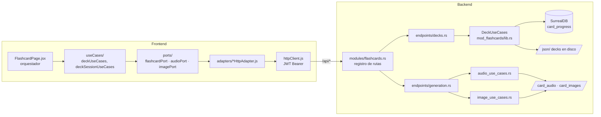

# Módulo `flashcards` — Estudio con tarjetas

## Propósito

Módulo principal del producto: estudio de vocabulario con flashcards por categorías gramaticales
y pares de idiomas (es_en, en_es, en_fr…), con progreso por usuario (SRS), audio TTS (.ogg Opus)
e imágenes generadas por IA (.avif).

## Estado y roadmap

- Estado: **activo** — es el módulo por defecto (`VITE_DEFAULT_MODULE=flashcards`).
- La generación de media (audio/imágenes) es tooling transversal: ver
  [`media-generation.md`](media-generation.md).

## Mapa de archivos

| Capa | Ruta | Qué contiene |
|---|---|---|
| Dominio | `backend/core/src/domain/models/flashcard.rs` | modelo de tarjeta |
| Puerto DB | `backend/core/src/ports/db_repository.rs` | `CardProgressRepository` |
| Casos de uso | `backend/mod_flashcards/src/lib.rs` | `DeckUseCases` |
| Casos de uso media | `backend/mod_flashcards/src/audio_use_cases.rs`, `image_use_cases.rs` | síntesis/generación |
| Prompt demo | `backend/mod_flashcards/src/landing_demo_image_prompt.rs` | prompts de imagen del demo |
| Batch | `backend/mod_flashcards/src/batch/` | generación batch de media |
| Registro rutas | `backend/api_main/src/modules/flashcards.rs` | los 17 endpoints del módulo |
| Handlers decks | `backend/api_main/src/api/endpoints/decks.rs` | catálogo, progreso, stats |
| Handlers media | `backend/api_main/src/api/endpoints/generation.rs` | resolve/generate/upload/delete |
| Frontend módulo | `client/src/modules/flashcards/` | manifiesto (`index.jsx`), `FlashcardPage.jsx` (orquestador), `composition.js`, `ports/`, `adapters/`, `useCases/`, `context/`, `features/` |
| Kit compartido UI | `client/src/components/flashcardStudy/` | la tarjeta compartida con el demo de landing — **leer `client/CLAUDE.md` §4 antes de tocarla** |
| Contenido | `json/<par>/<categoría>/<nivel>/*.json` | decks (sincronizados a Oracle) |
| Media | `card_audio/`, `card_images/` | audio .ogg e imágenes .avif por categoría |

## Plano del módulo (diagrama)



## Contratos / endpoints

Registrados en `backend/api_main/src/modules/flashcards.rs`; DTOs en
`api_main/src/api/endpoints/decks.rs` y `api_main/src/api/dto/generation.rs`. Todos con JWT.
Convención: `course_direction` (`es_en` default | `en_es`…) es query/campo opcional en casi todos.

### Catálogo y progreso (`decks.rs`)

| Método | Ruta | Entrada exacta | Devuelve |
|---|---|---|---|
| GET | `/api/categories` | query: `course_direction`, `include_counts` (default true) | categorías con conteos |
| GET | `/api/available-flashcards-files` | query: `course_direction`, `category` | decks de la categoría |
| GET | `/api/flashcards-data` | query: `user_id`, `category`, `deck`, `course_direction` | tarjetas del deck + progreso del usuario |
| POST | `/api/update-status` | `{user_id, category, deck, index, learned, course_direction?}` | progreso de 1 tarjeta |
| POST | `/api/update-batch` | `{user_id, category, deck, course_direction?, cards: [CardUpdateItem]}` | progreso en lote |
| POST | `/api/reset-all` | `{user_id, category, deck, course_direction?, scope?, confirm}` | reset de progreso |
| GET | `/api/srs/due` | query: `course_direction`, `limit` (default 5000) | tarjetas SRS pendientes |
| GET | `/api/learning-stats` | query: `course_direction` | estadísticas de aprendizaje |
| GET | `/api/phonics-data` | — | datos de fonética |
| POST | `/api/study/touch` | — (usuario del JWT) | registra día de estudio (racha) |

### Media (`generation.rs` — dto/generation.rs)

| Método | Ruta | Entrada exacta | Devuelve |
|---|---|---|---|
| POST | `/api/resolve-audio` | `SynthesizeSpeechBody` (ver abajo) | URL `?v=` si el audio EXISTE; 404 si no — **nunca genera** |
| POST | `/api/synthesize-speech` | `SynthesizeSpeechBody` | `{audio_url, voice_name, from_cache}` — genera si falta (premium/admin) |
| POST | `/api/resolve-image` | `{category, deck, index, def_index, course_direction?, form?}` | URL `?v=` si existe; 404 si no — **nunca genera** |
| POST | `/api/generate-image` | `GenerateImageBody`: lo de resolve + `{prompt, meaning?, usage_example?, usage_context?, alternative_example?, force_generation?, form?, legacy_image_path?, prompt_engine?, scene_complement?}` | `{path}` — pipeline Qwen→ComfyUI (premium/admin) |
| POST | `/api/upload-image` | multipart (ver `UploadImageRequest` en `mod_flashcards/src/image_use_cases.rs`) | sube imagen manual |
| DELETE | `/api/delete-image` | `{category, deck, index, def_index, course_direction?, form?}` | borra imagen |
| POST | `/api/delete-audio` | `DeleteAudioBody` (como Synthesize sin force) | borra audio |

`SynthesizeSpeechBody`: `{category, deck, text, voice_name, verb_name?, tone?, lang?, course_direction?, exclude_voice?, force_regenerate?}`.

### Invariantes (no romper)

- **`resolve-*` jamás genera media** — un 404 en resolve termina la anticipación/precarga (regla de `AI_OPERATIONS_CONTEXT.md`).
- **`update-batch` es UNA transacción SurrealDB** (`BEGIN…COMMIT`), no N peticiones — no descomponerla.
- Las URLs de media devuelven query `?v=<mtime>-<tamaño>`: la identidad cambia al sobrescribir el archivo; no cachear sin la query.
- Las imágenes web/responsive nuevas usan **768×512 (3:2) AVIF** en generación individual,
  batch y subida manual. Los assets 896×512 existentes siguen siendo compatibles y no se
  regeneran ni eliminan automáticamente.
- El catálogo permite repetir contenido completado: los grupos completos y las subcategorías
  anidadas muestran `Reiniciar`, con confirmación antes de borrar progreso; la tarjeta de
  finalización expone `Repetir este mazo` y reutiliza el reset del deck activo.
- Generación/borrado exigen rol `premium`/`admin` (hoy validado en frontend — deuda #2 de `client/CLAUDE.md` §9).
- `category='landing-demo'` enruta a otro proveedor TTS (ElevenLabs) — contrato con el módulo landing.
- **Piel de la app (jul 2026)**: la zona de estudio usa los tokens de profundidad de
  `client/src/styles/app-brand.css` — lienzo `--brand-canvas` (#0b1120), tarjeta sólida
  `--brand-surface-card` (#1b2438) con borde hairline `--brand-border-subtle`. Iconos de
  acción neutros en reposo (`--brand-icon-idle`) que pasan a rosa de marca al interactuar;
  el verde queda reservado al check de "aprendida" y el demo de landing conserva su piel
  propia (`--lp-demo-*`). Todo override de color de la app va con ámbito
  `[data-variant='app']` para no tocar el demo. Iconografía: familia única Lucide
  (`react-icons/lu`) con trazo `--brand-icon-stroke: 2`; Feather (`fi`) solo donde el kit
  se comparte con el demo; Font Awesome prohibido (regla completa en `client/CLAUDE.md` §6).
- En la app autenticada, el layout responsive (`max-width: 768px`, incluida la PWA) mantiene
  15 px de separación lateral compartida para la tarjeta y la barra de controles; el demo de
  landing conserva su geometría independiente. Los controles de navegación y el botón SRS
  miden 48 × 48 px en ese layout. Las filas de ejemplos usan `gap: 5px` y `padding: 3px`
  tanto en tarjetas estándar como de conjugación. En estas últimas, la imagen deja de imponer
  una relación de aspecto fija y ocupa el espacio vertical libre. La imagen principal usa
  `object-fit: contain` para mostrarse completa y una copia decorativa desenfocada cubre el
  espacio sobrante sin deformar ni recortar el contenido relevante. La tarjeta conserva el
  cálculo por espacio disponible, con `--fc-card-max-height: 560px` como tope móvil/PWA para
  evitar que se estire en pantallas altas y mantener cerca la barra y el footer; la separación
  entre tarjeta y barra de controles es de 20 px y la palabra principal usa `1.7rem`
  (jerarquía: la palabra manda sobre los ejemplos de `1.5rem`; en escritorio usa
  `clamp(1.6rem, 5vw, 2.25rem)` y la fonética baja a `clamp(1.05rem, 2.6vw, 1.15rem)`
  con mono moderno del sistema — solo variante app, el demo conserva sus valores). El botón
  SRS/calendario mantiene el círculo visual oculto hasta hover o focus. El footer absorbe el
  remanente inferior del shell móvil para no dejar una franja oscura al final, pero se oculta
  mientras está abierta la confirmación de nivel para no bloquear sus acciones. En móvil, el
  menú de cuenta expone el selector del idioma de interfaz; el aviso instalable PWA es no modal
  y solo sus botones capturan eventos, por lo que no puede bloquear tarjetas del catálogo.
- **Sesión PWA instalada**: bajo `display-mode: standalone` y hasta 768 px, el frente de la
  tarjeta adopta una composición inmersiva exclusiva: en conjugaciones, la imagen principal
  empieza en el final calculado de la barra verbal (`58px + 48px + safe-area`) y se alinea arriba,
  mientras los controles administrativos de imagen conservan 20 px de separación respecto a esa
  barra y el acceso SRS/calendario suma 10 px a su desplazamiento vertical para no pegarse a ella;
  sin hueco interno de `object-fit`, una copia desenfocada se prolonga detrás de la cabecera; la
  palabra/fonética/frases se superponen sobre un degradado inferior que concentra su oscuridad
  desde el 56%, alcanza su tramo fuerte entre el 72% y el 86% y deja visible la parte superior de la
  foto. Los reproductores de palabra y ejemplos, el acceso SRS y los controles de imagen comparten
  la superficie translúcida y blur de la navegación PWA; los reproductores de las frases usan el
  borde PWA reforzado para recortarse sobre la foto. Los iconos de reproducción y el
  calendario SRS y los controles de imagen miden 16 px dentro de sus áreas táctiles, con trazo
  Lucide uniforme. En los controles de imagen, regenerar usa blanco intenso y eliminar comparte
  el rojo vinotinto del reinicio. La barra de acciones se
  monta sobre el pie del hero y cada cambio real de tarjeta conserva el gesto horizontal con
  una transición de entrada, sin renderizar carrusel ni indicadores. Debajo se reserva la
  sección `Otros mazos para ti` con recomendaciones reales de `/api/learning-stats` (imagen,
  categoría, nivel y deck) navegables dentro de la sesión. Sus tarjetas PWA usan composición
  cinematográfica: imagen a sangre completa, degradado de contraste, metadatos en cristal y título
  superpuesto. La navegación inferior ya no se monta desde este módulo: es la píldora flotante de
  cristal del shell (`components/pwa/PwaShellNavigation.jsx` + `PwaBottomDock.jsx`, patrón WhatsApp
  iOS — ver `menu.jpg` en la raíz) con pestañas constantes (Inicio, Estudiar, Categorías, Idioma —
  sin buscador, deliberado), tokens `--pwa-nav-*` y estado activo por ruta; el carrusel
  `Otros mazos para ti` scrollea por detrás del cristal, su padding inferior la despeja y solapa
  2 px el hero para evitar una costura subpíxel visible al terminar la foto.
  `Categorías` abre el catálogo vía uiBridge (`openCatalog`) cuando la sesión de estudio está activa. La vista web
  responsive, el demo de landing y los flujos de carga/finalización conservan su composición anterior.
  Barra y recomendaciones consumen los tokens PWA compartidos de `styles/app-brand.css`; las tarjetas
  de recomendaciones usan el mismo radio y borde que el dashboard y reducen el halo rosa decorativo.
  La cabecera visual PWA vive en `components/flashcardStudy/features/PwaCardHeader.jsx` y muestra
  el isotipo blanco centrado; reemplaza dentro de esta sesión al header compartido, por lo que no
  aparecen hamburguesa, nombre `Fluency`, avatar ni segundo menú.
  En tarjetas de verbos irregulares, `ConjugationTable` se presenta como una cápsula de cristal
  única con v1/v2/v3 visibles; las frases PWA aumentan de tamaño y la barra de acciones usa
  superficies translúcidas con botones de contraste independiente, igual que la píldora de
  navegación del shell.
  El isotipo queda libre de contenedor visual y la cápsula irregular comparte la franja superior,
  a su derecha. Los controles siguen el patrón de acciones flotantes tipo Tinder: no existe una
  cápsula exterior y cada acción tiene su propio círculo, contraste y jerarquía táctil.
  La navegación anterior/siguiente no se renderiza visualmente en PWA: el cambio se hace con
  swipe. `PwaStudyControls.jsx` concentra únicamente reinicio, progreso y aprendida con Lucide;
  sus tres superficies comparten el cristal translúcido, borde neutro y blur de la navegación
  inferior; solo los iconos expresan estado: check verde y reinicio rojo vinotinto;
  el control web compartido permanece intacto. `PwaConjugationNav.jsx` y su CSS aíslan por
  completo V1/V2/V3 de `ConjugationTable`: ocupan una segunda fila dentro del mismo header
  difuminado como navegación móvil minimalista, sin subrayado, fondo ni cápsula: las formas se
  muestran con solo la inicial de cada palabra en mayúscula; la activa usa mayor peso y blanco intenso
  sin fondo, cápsula ni halo,
  mientras las demás bajan su contraste. Al presionar, el texto reduce brevemente su escala y cambia
  a blanco. No muestran pronunciación. La densidad negra superior se controla con
  `--pwa-header-black-opacity` en `PwaCardHeader.module.css`; una luz radial muy contenida evita un
  negro plano y la cabecera se desvanece verticalmente sobre la imagen con un difuminado amplio,
  sin desplazarla.
  Cuando la tarjeta no tiene conjugación, la cabecera se reduce a 64 px y la imagen comienza
  a 58 px; palabra, frases y acciones suben los 48 px que ocuparía V1/V2/V3, sin dejar hueco.
  Las frases de ejemplo PWA conservan su estilo flotante original, sin franja ni borde, y únicamente
  redondean sus esquinas a 14 px; mantienen 8 px de separación y su audio usa el mismo círculo
  translúcido del reproductor de la
  palabra. El hero ocupa hasta 80svh para que
  dos ejemplos conserven aire antes de `Otros mazos para ti`. `DefinitionList` publica
  `data-count` y el título se posiciona según haya una o dos frases; en verbos irregulares con dos
  ejemplos reserva 14 px adicionales entre la palabra/fonética y la primera frase para que los
  bloques no se amontonen. En tarjetas estándar, palabra, fonética y frases bajan juntas 10 px sin
  modificar la posición ni el tamaño de la imagen;
  cuando no existe imagen, el contenedor conserva exactamente esa geometría y solo el asset cuadrado
  `noimages.png` reduce su contenido al 82% y lo desplaza 9% hacia arriba dentro del mismo recorte;
  el bloque completo termina a 8 px de la barra flotante para aprovechar el hero sin dejar un vacío;
  palabra, frases y acciones comparten un desplazamiento vertical para conservar esa relación.
  El contenedor que realiza el giro PWA conserva `overflow: visible`; el recorte pertenece a cada
  cara para no aplanar `preserve-3d` ni ocultar el reverso en WebKit/Chrome instalados.
  El reverso PWA reutiliza la imagen y deja únicamente el isotipo en una cabecera corta, sin
  V1/V2/V3, controles de estudio, sección `Otros mazos para ti` ni barra de navegación. Cada definición
  se presenta como bloque de cristal desplazable con contraste reforzado y tipografía móvil mayor;
  el reverso web conserva su composición tradicional. La visibilidad de la foto y del cristal se
  ajusta con `--pwa-back-image-opacity` y `--pwa-back-glass-opacity` en `CardBack.module.css`.
  El catálogo abierto desde la barra de navegación se presenta como una bottom sheet PWA con
  mecánica nativa iOS (referencia `img2.png` en la raíz): entra deslizándose desde fuera de
  pantalla (curva `cubic-bezier(0.32, 0.72, 0, 1)`), el scrim hace fade y la sesión retrocede con
  efecto card-stack (escala 0.92 + esquinas redondeadas, regla en `App.css` sobre
  `[data-catalog-open]`). Se cierra arrastrando hacia abajo desde la franja del asa (56px
  superiores, con seguimiento del dedo, umbral 110px y snap-back animado); la X se oculta en PWA
  móvil y la salida por gesto anima el deslizamiento antes de desmontar (estado `isSheetDismissing` en
  `CategorySelector.jsx`). Mantiene la sesión atenuada detrás, muestra las categorías en un
  carrusel horizontal de chips, fija el selector segmentado de nivel y concentra los mazos en un
  único scroll vertical. Categorías y contenido comparten el mismo fondo negro PWA y se distinguen
  únicamente mediante una línea horizontal con el borde canónico. La fila de nivel aprovecha el
  100% del ancho y se extiende 6 px hacia cada margen: Basic/Intermediate/Advanced se expanden en
  el espacio disponible y la ayuda queda en la esquina derecha con 50 px, el mismo cristal e icono
  de 16 px del estándar PWA. La ayuda de categoría
  se abre como una segunda hoja inferior; el catálogo web conserva su modal de dos paneles.
  La finalización de nivel/grupo también tiene composición PWA propia: lienzo negro sin tarjeta
  azul exterior, estadísticas y recomendación en cristal neutro, acciones translúcidas y navegación
  inferior oculta para no cubrir los botones. Conserva la felicitación animada completa —halo,
  barrido de luz, confeti, destellos y anillos— con intensidad adaptada al fondo negro; la versión
  web mantiene su diseño original.

## Flags y activación

- Cargo feature: `flashcards` (default). Build aislado: `cargo build -p api_main --no-default-features --features auth,flashcards`.
- Vite: `VITE_ENABLE_FLASHCARDS` (opt-out), `VITE_DEFAULT_MODULE=flashcards`. Ruta `/flashcard` (o `/` sin landing).
- Sparse: `./scripts/sparse-module.sh flashcards`.

## Dependencias con otros módulos

- **shell-auth** ([`shell-auth.md`](shell-auth.md)): JWT, `AuthContext`, httpClient.
- **Kit `flashcardStudy`** (shell, no módulo): compartido con el demo de `landing` — un cambio en la tarjeta afecta a ambos.
- **media-generation** ([`media-generation.md`](media-generation.md)): pipeline de generación de audio/imágenes.
- `dashboard` y `landing` consumen contratos compartidos en `client/src/contracts/` (`courseDirection.js`, `landingDemoNamespace.js`) — no imports directos entre módulos.

## Datos

SurrealDB: `card_progress` (índice `idx_card_progress_user` sobre `user_id`), días de estudio/racha.
Ver [`database_schema_diagram.md`](../../database_schema_diagram.md). Los decks NO viven en la DB:
viven en `json/` (disco de Oracle en prod).

## Cómo probar

```bash
./scripts/sparse-module.sh flashcards      # aislar el módulo
./start.sh                                 # stack local completo
curl -X POST http://127.0.0.1:5173/api/auth/dev-guest   # login sin OAuth
# UI: http://localhost:5173/flashcard
cd client && npm test                      # incluye test-deck-use-cases y test-deck-session-use-cases
# Desde la raíz: matriz local completa (requiere ./start.sh activo)
./scripts/test-local-preprod.sh --full
```

Cambios visuales en la tarjeta: arnés pixel-diff obligatorio (`client/CLAUDE.md` §8).

El gate `--quick` no requiere servicios. `--full` añade smoke HTTP, SurrealDB 1.5.5 real y E2E
en escritorio/móvil/WebKit; `--all` agrega una carga k6 corta limitada por código a localhost.

### Matriz cubierta por el gate local

| Capa | Cobertura automatizada |
|---|---|
| Dominio JS | rutas, contratos, catálogo, sesión, SRS (1.000 propiedades), cachés de audio/imagen y armado del mazo SRS |
| Componentes | tarjeta/dorso, controles y teclado, imagen (carga/error/timeout), idioma, viewport y puente UI |
| Servicios frontend | todos los métodos de los adaptadores de flashcards, audio, imagen y SRS; fallback estático, IndexedDB y compresión HEIC/canvas/WASM→AVIF |
| Backend Rust | unitarias existentes, mocks de puertos, propiedades de racha y validación SRS, handler Axum y snapshot de features |
| API + DB local | catálogo, mazo, progreso individual y lote transaccional, SRS, reset, estadísticas, racha, fonética, resolución y descarga de media |
| E2E | sesión dev-guest; cambio español/inglés y dirección de estudio; dashboard; catálogo, ayuda, niveles, varias categorías y orden persistido; reset cancelar/confirmar; navegación por botones y gestos; giro frente/dorso; audio; checks múltiples; final de nivel y de ruta; aislamiento de progreso entre dos usuarios, en Chrome, Pixel 7 y WebKit/iPhone |
| Carga | k6 sobre catálogo, decks, mazo, estadísticas y escrituras de progreso; restaura el progreso al terminar |

Los E2E permiten resolver y descargar media existente, pero interceptan generación, subida y
borrado. Esos proveedores se validan con adaptadores/mocks para no consumir Gemini/ElevenLabs ni
mutar `card_audio/`, `card_images/` o `img/`. Durante toda la integración, el runner crea
`.local-preprod-media.lock`: el backend debe responder `423 Locked` a una mutación inocua antes de
comenzar. Además compara un inventario SHA-256 de **todos** los archivos de esas tres rutas,
incluidos los ignorados y no versionados. Si detecta una diferencia, falla y no intenta limpiar ni
borrar el archivo afectado: la recuperación siempre es manual y explícita.
